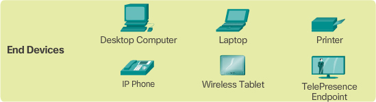
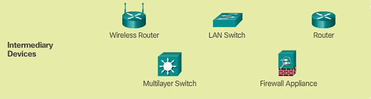
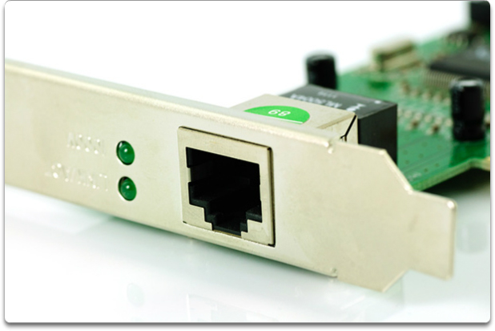

## Overview of Network Components

The network infrastructure contains three categories of network components

- devices
- media
- services

Devices and media are the physical elements, or hardware, of the network. 
Hardware is often the visible
such as a laptop, PC, switch, router, wireless access point, or the cabling used to connect the devices.

Services include email hosting services and web hosting services. 
Processes provide the functionality that directs and moves the messages through the network. 
are less obvious

### Devices

end device

intermediary device

- Regenerate and retransmit data signals
- Maintain information about what pathways exist through the network and internetwork
- Notify other devices of errors and communication failures
- Direct data along alternate pathways where there is a link failure
- Classify and direct messages according to priorities
- Permit or deny the flow of data, based on security settings

### Media

- Metallic wires within cables

  data is encoded into electrical impulses

- Glass or plastic fibers (fiber optic cable)

  data is encoded as **pulses of light**

- Wireless transmission

  data is encoded using **wavelengths from the electromagnetic spectrum**

 Network Interface Card

 

 - Physical Port – end device
 
- Interface – routers

## Network Architecture

four basic characteristics that the underlying architectures need to address

- Fault Tolerance
- Scalability
- Quality of Service (QoS)
- Security

At the foundation of all network architectures, and, in fact, at the foundation of the Internet itself, are routers and switches. Routers and switches transport data, voice, and video communications, as well as allow for wireless access, and provide for security.

## Network Security

### Security Threats

- Viruses, worms, and Trojan horses – malicious software and arbitrary code running on a user device

- Spyware and adware – software installed on a user device that secretly collects information about the user

- Zero-day attacks, also called zero-hour attacks – an attack that occurs on the first day that a vulnerability becomes known

- Hacker attacks – an attack by a knowledgeable person to user devices or network resources

- Denial of service attacks – attacks designed to slow or crash applications and processes on a network device

- Data interception and theft – an attack to capture private information from an organization’s network

- Identity theft – an attack to steal the login credentials of a user in order to access private data

### Security Solutions

- Antivirus and antispyware – These are used to protect end devices from becoming infected with malicious software.

- Firewall filtering – This is used to block unauthorized access to the network. This may include a host-based firewall system that is implemented to prevent unauthorized access to the end device or a basic filtering service on the home router to prevent unauthorized access from the outside world into the network.

In addition to the above, larger networks and corporate networks often have other security requirements:

- Dedicated firewall systems – These are used to provide more advanced firewall capabilities that can filter large amounts of traffic with more granularity.

- Access control lists (ACL) – These are used to further filter access and traffic forwarding.

- Intrusion prevention systems (IPS) – These are used to identify fast-spreading threats, such as zero-day or zero-hour attacks.

- Virtual private networks (VPN) – These are used to provide secure access to remote workers.

## Check Your Understanding Questions

1. What is a group of web pages that groups of individuals can edit and view together called?
(B)

A. Podcasting

B. Wiki

C. Weblog (blog)

D. Instant messaging

E. Access point

F. TelePresence endpoint

2. Which of the following are disadvantages of peer-to-peer networking? (Choose two.)
(B, D)

A. Expensive to set up and maintain

B. No centralized administration

C. Complex configuration

D. Scalability

3. Which devices would be considered end devices on a network? (Choose four.)
(B, C, D, E)

A. Switch

B. Printer

C. IP phone

D. Server

E. Tablet computer

F. Wireless access point

4. What type of information would be found on a logical topology diagram?
(C)

A. Location of departmental printer

B. Length and type of all cable runs

C. IP addressing scheme

D. Location of departmental switch

5. What is a network infrastructure that provides access to other networks over a wide geographic area?
(D)

A. LAN

B. WLAN

C. MAN

D. WAN

E. SAN

6. Which of the following are business-class Internet connection technologies normally supplied by a service provider? (Choose two.)
(A, B) -> (A, C)

A. Leased lines

B. Broadband cable

C. Metro Ethernet

D. Mobile services

E. Cellular

7. Which technology would be best to provide a home user with a high-speed, always-on Internet connection?
(B)

A. Dial-up

B. DSL

C. Satellite

D. Cellular

8. What is a converged network?
(B)

A. A network that makes use of both fiber-optic and copper connections

B. A network where voice, video, and data move over the same infrastructure

C. A network that makes use of both wired and wireless technology

D. A network that makes use of both satellite and terrestrial connections to move data

9. What is a fault-tolerant network?
(C)

A. A network that can provide priority treatment of voice and video traffic

B. A network that offers secure transactions

C. A network that can reroute traffic in case of device failure

D. A network that is incapable of failing

10. Which type of traffic must receive the highest priority from QoS?
(C)

A. Web traffic

B. Email

C. VoIP

D. Order processing

11. What are the primary requirements of information security? (Choose three.)
(A, B, C)

A. Confidentiality

B. Integrity

C. Availability

D. QoS

E. Scalability

12. In which scenario would the use of a WISP(wireless internet service provider) be recommended?
(B)

A. an Internet cafe in a city

B. a farm in a rural area without wired broadband access

C. any home with multiple wireless devices

D. an apartment in a building with cable access to the Internet

13. List four current network trends.
- bring your own device
- online collaboration
- video communication
- cloud computing

14. Describe some common everyday uses of a modern-day network.
- online study
- web browser
- online entertainment

15. In what ways has the network transformed the way we learn?
- good study resources are made available to anyone from anywhere