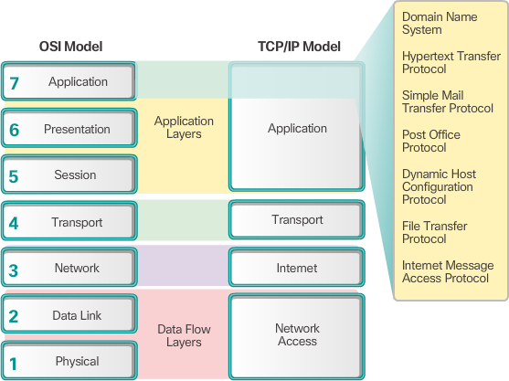
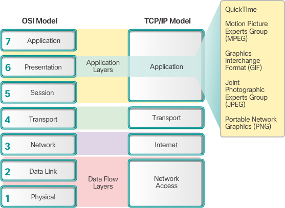
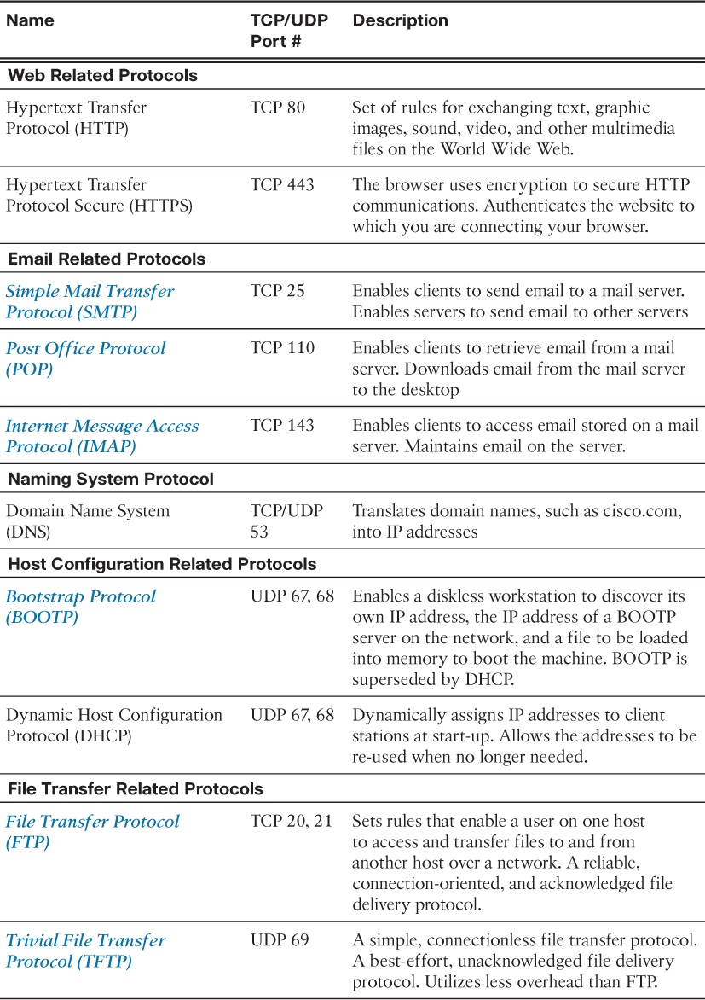
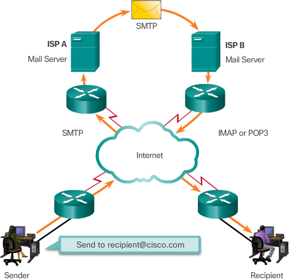
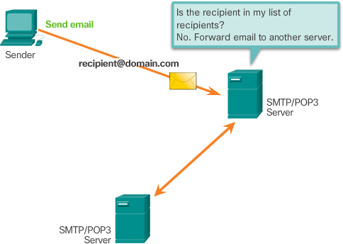
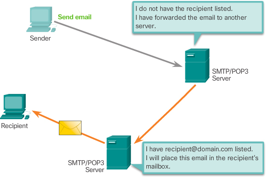
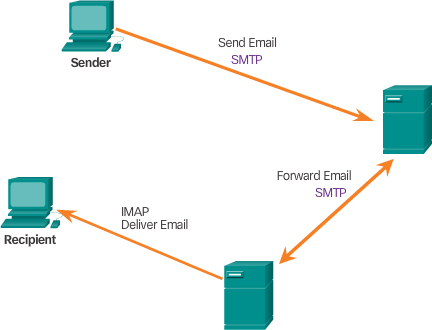
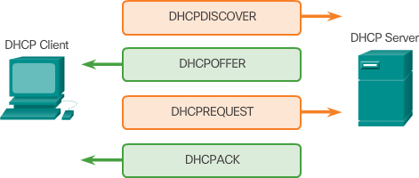
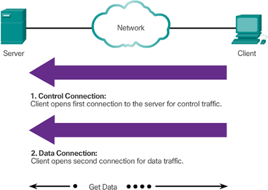

## Application Layer Protocol

- OSI - application layer

- Some well-known standards at presentation layer

- session layer create and maintain dialogs between source and destination applications. The session layer handles the exchange of information to initiate dialogs, keep them active, and to restart sessions that are disrupted or idle for a long period of time.

- client-server model

- P2P model: 

Many P2P applications allow users to share pieces of many files with each other at the same time. 
Clients use a small file called a **torrent** file to locate other users who have pieces that they need so that they can connect directly to them. 
This file also contains information about tracker computers that keep track of which users have what files. 
Clients ask for pieces from multiple users at the same time, known as a **swarm**. This technology is called **BitTorrent**. There are many BitTorrent clients including BitTorrent, uTorrent, Frostwire, and qBittorrent.

### HTTP

When a web address or uniform resource locator (URL) is typed into a web browser, the web browser establishes a connection to the web service running on the server using the HTTP protocol. URLs and Uniform Resource Identifier (URIs) are the names most people associate with web addresses.

HTTPS uses the same client request-server response process as HTTP, but the data stream is encrypted with **Secure Socket Layer** (SSL) before being transported across the network.

### Email Protocols

Email supports three separate protocols for operation: Simple Mail Transfer Protocol (SMTP), Post Office Protocol (POP), and IMAP. The application layer process that sends mail uses SMTP. A client retrieves email, however, using one of the two application layer protocols: POP or IMAP.

- SMTP

When the server receives the message, it either places the message in a local account, if the recipient is local, or forwards the message to another mail server for delivery

- POP

POP is used by an application to retrieve mail from a mail server. With POP, mail is downloaded from the server to the client and then deleted on the server. 

The server starts the POP service by passively listening on TCP port 110 for client connection requests. When a client wants to make use of the service, it sends a request to establish a TCP connection with the server. 

- IMAP

Unlike POP, when the user connects to an IMAP-capable server, copies of the messages are downloaded to the client application. 
The original messages are kept on the server until manually deleted. 

### DHCP

Many networks use both DHCP and static addressing. DHCP is used for general purpose hosts, such as end-user devices. Static addressing is used for network devices, such as gateways, switches, servers, and printers.

DHCPv6 (DHCP for IPv6) provides similar services for IPv6 clients. One important difference is that DHCPv6 does not provide a default gateway address. This can only be obtained dynamically from the router’s Router Advertisement message.

When an IPv4, DHCP-configured device boots up or connects to the network, the client broadcasts a DHCP discover (DHCPDISCOVER) message to identify any available DHCP servers on the network. A DHCP server replies with a DHCP offer (DHCPOFFER) message, which offers a lease to the client. The offer message contains the IPv4 address and subnet mask to be assigned, the IPv4 address of the DNS server, and the IPv4 address of the default gateway. The lease offer also includes the duration of the lease.

The client may receive multiple DHCPOFFER messages if there is more than one DHCP server on the local network. Therefore, it must choose between them, and sends a DHCP request (DHCPREQUEST) message that identifies the explicit server and lease offer that the client is accepting. A client may also choose to request an address that it had previously been allocated by the server.

DHCPv6 has similar set of messages to those shown in the figure for DHCP for IPv4. The DHCPv6 messages are SOLICIT, ADVERTISE, INFORMATION REQUEST, and REPLY.

### FTP

FTP was developed to allow for data transfers between a client and a server.

- first connection to the server for control traffic using TCP port **21**, consisting of client commands and server replies.

- second connection to the server for the actual data transfer using TCP port **20**. This connection is created every time there is data to be transferred.

## Check Your Understanding Questions

1. The TCP/IP application layer effectively consists of which three OSI layers?
(B)

A. Application, session, transport

B. Application, presentation, session

C. Application, transport, network

D. Application, network, data link

2. What three protocols do email users and servers use to process email? (Choose three.)
(B, C, E)

A. DHCP

B. SMTP

C. IMAP4

D. DNS

E. POP3

3. DHCP enables clients on a network to do which of the following?
(C)

A. Have unlimited telephone conversations

B. Play back video streams

C. Obtain IP addresses

D. Track intermittent denial of service attacks

4. What TCP/IP layer supports the exchange of data between programs running on the source and destination hosts?
(A)

A. Application

B. Transport

C. Internetwork

D. Network

5. What is the purpose of DNS?
- map domain name to IP addr