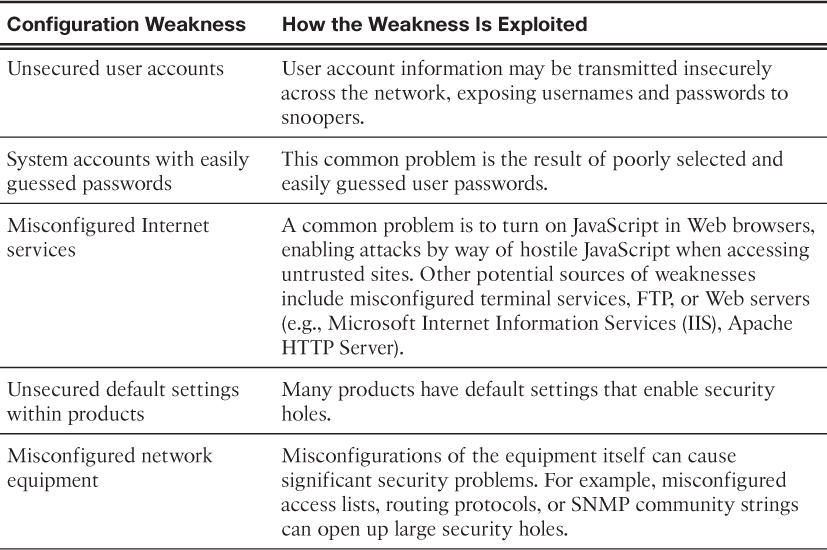
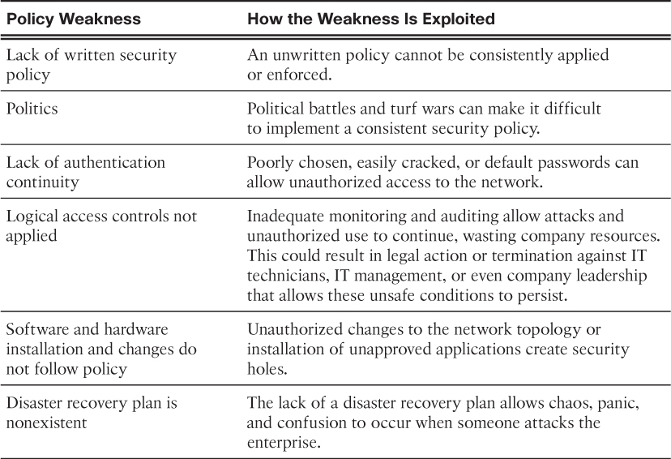
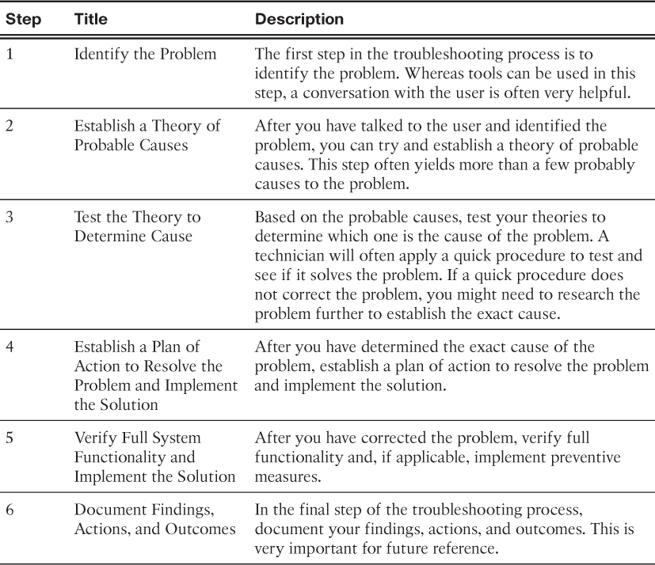

## Network Design


 In the end, the goal for a good network design, even for a small network, is to enhance the productivity of the employees and minimize network downtime.


### IP Addressing for a Small Network

if all servers are assigned a host address between the range of 50–100, it is easy to identify server traffic by IP address.

If the addresses for these resources are not planned and documented, the security and accessibility of the devices are not easily controlled. If a server has a random address assigned, blocking access to this address is difficult, and clients may not be able to locate this resource.


### Redundancy in a Small Network

In order to maintain a high degree of reliability, redundancy is required in the network design. Redundancy helps to eliminate single points of failure.

Redundancy can be accomplished by installing duplicate equipment, but it can also be accomplished by supplying duplicate network links for critical areas

- Data Center – If one server fails, another is there to handle customer requests.
- Links – If the link to one switch fails, the link to the second switch is still available.
- Switches – Redundant switches are present to avoid a switching failure.
- Routers – Router redundancy can help to ensure that application transactions received from external traffic can be handled in the event of a router or route failure.
- pay for a second service provider as backup.


### Network Applications

Applications are the software programs used to communicate over the network. Some end-user applications are network-aware, meaning that **they implement application layer protocols** and are able to communicate directly with the lower layers of the protocol stack. Email clients and web browsers are examples of this type of application.


### VoIP

VoIP devices convert analog into digital IP packets. The device could be an analog telephone adapter (ATA) that is attached between a traditional analog phone and the Ethernet switch.


### Real-Time Applications

To transport streaming media effectively, the network must be able to support applications that require delay-sensitive delivery. Real-Time Transport Protocol (RTP) and Real-Time Transport Control Protocol (RTCP) are two protocols that support this requirement. RTP and RTCP enable control and scalability of the network resources by allowing Quality of Service (QoS) mechanisms to be incorporated. These QoS mechanisms provide valuable tools for minimizing latency issues for real-time streaming applications.


### Network Growth

To scale a network, several elements are required:
- Network documentation – physical and logical topology
- Device inventory – list of devices that use or comprise the network
- Budget – itemized IT budget, including fiscal year equipment purchasing budget
- Traffic analysis – protocols, applications, and services and their respective traffic requirements, should be documented


To determine traffic flow patterns, it is important to
- Capture traffic during peak utilization times to get a good representation of the different traffic types.
- Perform the capture on different network segments; some traffic will be local to a particular segment.

This analysis can be used to make decisions on how to manage the traffic more efficiently. 
This can be done by reducing unnecessary traffic flows or changing flow patterns altogether by moving a server, for example.

Sometimes, simply relocating a server or service to another network segment improves network performance and accommodates the growing traffic needs. At other times, optimizing the network performance requires major network redesign and intervention.


## Network Security


### Types of Threats

- Information Theft – This is breaking into a computer to obtain confidential information. Information can be used or sold for various purposes. Example: stealing an organization’s proprietary information, such as research and development information.

- Data Loss and Manipulation – This is breaking into a computer to destroy or alter data records. Examples of data loss: sending a virus that reformats a computer’s hard drive. Examples of data manipulation include breaking into a records system to change information, such as the price of an item.

- Identity Theft – This is a form of information theft where personal information is stolen for the purpose of taking over someone’s identity. Using this information, an individual can obtain legal documents, apply for credit, and make unauthorized online purchases. Identity theft is a growing problem costing billions of dollars per year.

- Disruption of Service – This is preventing legitimate users from accessing services to which they should be entitled. Examples include Denial of Service (DoS) attacks on servers, network devices, or network communications links.


### Types of Vulnerabilities

Vulnerability is the **degree of weakness** which is inherent in every network and device.

- Technological Vulnerabilities
    -  TCP/IP protocol weakness
    - Operating system weakness
    - Network equipment weakness


- Configuration Vulnerabilities




- Policy Vulnerabilities




### Types of Malware

Malware or malicious code (malcode) is short for malicious software. It is **code or software** that is specifically designed to damage, disrupt, steal, or inflict “bad” or illegitimate action on data, hosts, or networks. Viruses, worms, and Trojan horses are types of malware.


- Viruses

A computer virus is a type of malware that propagates by **inserting a copy of itself** into, and becoming part of, another program. It spreads from one computer to another, leaving infections as it travels. 

Viruses can range in severity from causing mildly annoying effects to damaging data or software and causing denial-of-service (DoS) conditions. 

Almost all viruses are attached to an executable file, which means the virus may exist on a system but will not be active or able to spread until a user runs or opens the malicious host file or program. 
When the host code is executed, the viral code is executed as well. Normally, the host program keeps functioning after it is infected by the virus. However, some viruses overwrite other programs with copies of themselves, which destroys the host program altogether.


- Worms

Computer worms are similar to viruses in that they replicate functional copies of themselves and can cause the same type of damage. 

In contrast to viruses, which require the spreading of an infected host file, worms are **standalone software** and do not require a host program or human help to propagate. 

A worm does not need to attach to a program to infect a host and enter a computer through a vulnerability in the system. Worms take advantage of system features to travel through the network unaided.


- Trojan Horses

It is a harmful piece of software that **looks legitimate**. Users are typically **tricked into loading and executing it** on their systems. 

After it is activated, it can achieve any number of attacks on the host, from irritating the user (popping up windows or changing desktops) to damaging the host (deleting files, stealing data, or activating and spreading other malware, such as viruses). Trojan horses are also known to create back doors to give malicious users access to the system.

Unlike viruses and worms, Trojan horses **do not reproduce** by infecting other files, nor do they self-replicate. 

Trojan horses must spread through user interaction such as opening an e-mail attachment or downloading and running a file from the Internet.


- Reconnaissance Attacks

For reconnaissance attacks, external attackers can use Internet tools, such as the nslookup and whois utilities, to easily determine the IP address space assigned to a given corporation or entity. 

After the IP address space is determined, an attacker can then ping the publicly available IP addresses to identify the addresses that are active. To help automate this step, an attacker may use a ping sweep tool, such as fping or gping, which systematically pings all network addresses in a given range or subnet. This is similar to going through a section of a telephone book and calling each number to see who answers.


### Denial of Service Attacks (11.2.2.4)

DoS attacks take many forms. Ultimately, they prevent authorized people from using a service by consuming system resources.

Denial of Service (DoS) attacks are the most publicized form of attack and also among the most difficult to eliminate. Even within the attacker community, DoS attacks are regarded as trivial and considered bad form because they require so little effort to execute. 

But because of their **ease of implementation** and **potentially significant damage**, DoS attacks deserve special attention from security administrators.


## Network Attack Mitigation


### Backup, Upgrade, Update, and Patch


### Authentication, Authorization, and Accounting 

AAA is a way to control
- who is permitted to access a network (authenticate), 
- what they can do while they are there (authorize), 
- and what actions they perform while accessing the network (accounting).


### Firewalls

Network firewalls reside between two or more networks, control the **traffic between** them, and help prevent unauthorized access. 

Host-based firewalls or personal firewalls are installed on end systems. Firewall products use various techniques for determining what is permitted or denied access to a network. These techniques are
- Packet filtering – Prevents or allows access based on IP or MAC addresses.
- Application filtering – Prevents or allows access by specific application types based on port numbers.
- URL filtering – Prevents or allows access to websites based on specific URLs or keywords.
- Stateful packet inspection (SPI) – Incoming packets **must be legitimate responses to requests from internal hosts**. Unsolicited packets are blocked unless permitted specifically. SPI can also include the capability to recognize and filter out specific types of attacks, such as denial of service (DoS).


### Device Security


- Passwords

This command will block login attempts for 120 seconds if there are three failed login attempts within 60 seconds.

```
Router(config)# login block-for 120 attempts 3 within 60
```

- Exec Timeout

This command configures the device to disconnect idle users after 10 minutes.

```
Router(config)# line vty 0 4

Router(config-line)# exec-timeout 10
```

- Enable SSH

```
R1# conf t

Enter configuration commands, one per line. End with CNTL/Z.

R1(config)# ip domain-name span.com

R1(config)# crypto key generate rsa general-keys modulus 1024

The name for the keys will be: R1.span.com


% The key modulus size is 1024 bits

% Generating 1024 bit RSA keys, keys will be non-exportable...

[OK] (elapsed time was 3 seconds)


R1(config)#

*Jan 9 15:02:22.043: %SSH-5-ENABLED: SSH 1.99 has been enabled

R1(config)# username Bob secret cisco

R1(config)# line vty 0 4

R1(config-line)# transport input ssh

R1(config-line)# exit
```


## Network Testing and Verification

- ping

- traceroute

- show
    - show running-config
    - show interfaces
    - show arp
    - show ip route
    - show protocols
    - show version

- ipconfig
    - ipconfig /all
    - ipconfig /displaydns

- arp -a


- debug
    - debug ip icmp (turn on debug)
    - undebug all

- terminal monitor (ebable log via VTY)


## Network Troubleshooting




### Duplex Mismatch

Duplex mismatch conditions may be difficult to troubleshoot as the communication between devices still occurs.

- IP addressing issue on IOS devices
- IP addressing issue on end devices
- default gateway issue
- dns issue
    - Duplex mismatch conditions may be difficult to troubleshoot as the communication between devices still occurs.


## Check Your Understanding Questions


1. Why should the IP addressing scheme be carefully planned and documented? (Choose two.)
(B, C)

A. Improved network performance

B. Easier control of security

C. Easier troubleshooting

D. Reduction in network traffic

E. Elimination of requirement for subnetting

2. What would be considered an example of redundancy in network design? (Choose three.)
(B, C, D)

A. Installation of a switch that functions at both Layer 2 and Layer 3.

B. Installation of duplicate switches in a company network.

C. Keeping a spare router that has already been properly configured.

D. Installation of multiple high-speed links to the company server farm.

3. Which type of traffic should be given the highest priority on a network?
(A)

A. Voice

B. SMTP

C. Instant messaging

D. FTP

4. Which planning and design factors would be considered as part of **manageability** focus when implementing a small network? (Choose two.)
(A, D) -> (B, E)
The five focus areas when implementing a small network are **cost, expandability, manageability, speed, and ports**. Type of cable run would fall under cost, upgrades to network devices are part of expandability, prioritization of data traffic and IP addressing schemes are part of manageability, bandwidth requirement is part of speed, and number of interfaces required would be ports.

A. Types of cable runs

B. Prioritization of data traffic

C. Upgrades to network devices

D. Number of interfaces required

E. IP addressing scheme

F. Bandwidth requirement

5. What is true of an application layer service?
(B)

A. Application layer services provide the human interface.

B. Application layer services interface with the network and prepare the data for transfer.

C. Application layer services include such things as email and web clients.

D. Application layer services are dependent on the OS vendor.

6. Which network protocol should a network administrator use to remotely configure a network device?
(D)

A. FTP

B. HTTP

C. Telnet

D. SSH

7. Fill in the blank. (VoIP) allows users of analog phones to take advantage of the IP network.

8. What factors should be taken into account when using a protocol analyzer to determine traffic flow on a network? (Choose two.)
(B, C)

A. Always capture the traffic on the same network segment.

B. Capture traffic during peak utilization times.

C. Capture traffic on different network segments.

D. Capture traffic only during off-peak times.

E. Capture traffic during both peak and off-peak times.

9. A key network switch has failed because of excessive humidity. What type of physical threat caused the problem?
(B)

A. Hardware threat

B. Environmental threat

C. Electrical threat

D. Maintenance threat

10. What is a network vulnerability?
(A)

A. The degree of weakness inherent in a network

B. Tools used to launch attacks against a network

C. Individuals interested and qualified in taking advantage of security weaknesses

D. Ping of death

11. The network administrator set the admin password on a new router to pa55w0rd. The security of the router was later compromised. What type of vulnerability allowed the attack?
(B)

A. Technology

B. Configuration

C. Policy

12. Making illegal online purchases is what type of security threat?
(B)

A. Information theft

B. Identity theft

C. Data loss/manipulation

D. Disruption of service

13. What name is given to a program that is disguised as another program to attack a system?
(B)

A. Virus

B. Trojan horse

C. Worm

14. An attacker runs a ping sweep against a network. What type of attack is this?
(C) -> (A)

A. Reconnaissance

B. Access

C. Denial of service

15. What type of attack is a smurf attack?
(A) -> (C)

A. Reconnaissance

B. Access

C. Denial of service

16. With regard to firewall technology, what is stateful packet inspection?
(A)

A. Incoming packets must be legitimate responses from internal requests.

B. The incoming packet must have been initiated from a trusted source.

C. The incoming packet must be in an active state before being admitted to the network.

D. Only secure traffic, such as SSH and HTTPS, is permitted through the firewall.

17. Which of the following is an example of a strong password?
(C, E) -> (C)

A. Champion

B. Cisco123

C. 2#4@Tpg%

D. Eruces

E. Pa55w0rd (no symbol)

18. How is an extended ping entered on a Cisco router?
(D)

A. Type ping/e and press Enter

B. Type ping followed by a destination IP address

C. Type ping followed by a source IP address

D. Type ping and press Enter

19. What show command can be issued on a Cisco router to view the configuration register value?
(D)

A. show ip route

B. show running-config

C. show protocols

D. show version

E. show cdp neighbors detail
