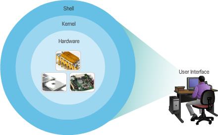
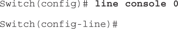
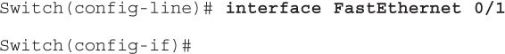
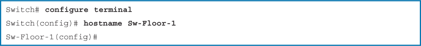
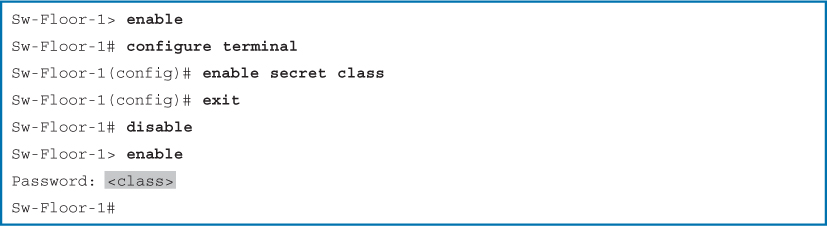
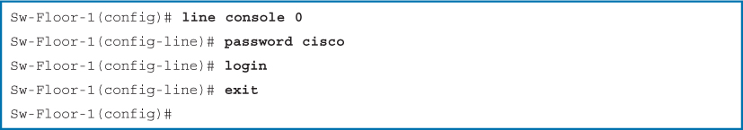
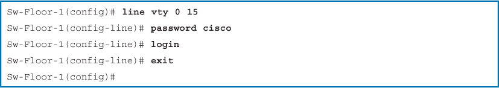
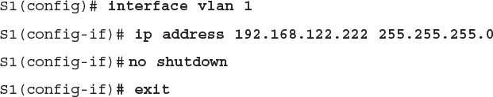
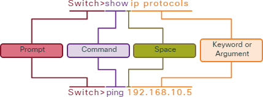
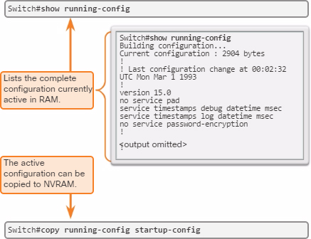

This chapter introduced the Cisco IOS. It detailed the various modes of the Cisco IOS and examined the basic command structure that is used to configure it. It also walked through the initial settings of a Cisco IOS switch device, including setting a name, limiting access to the device configuration, configuring banner messages, and saving the configuration.

The Cisco Internetwork Operating System (IOS) is a generic term for the collection of network operating systems used by Cisco networking devices


## Operating System


All end devices and network devices require an operating system (OS). As shown in Figure 2-1, the portion of the OS that interacts directly with computer hardware is known as the **kernel**. The portion that interfaces with applications and the user is known as the **shell**. The user can interact with the shell using a command-line interface (CLI) or a graphical user interface (GUI).




The CLI is less resource intensive and very stable when compared to a GUI.


The operating system on home routers is usually called **firmware**. The most common method for configuring a home router is by using a web browser-based GUI.


Network operating systems are similar to a PC operating system.

A CLI-based network operating system like the Cisco IOS on a switch or router enables a network technician to

- Use a keyboard to run CLI-based network programs

- Use a keyboard to enter text and text-based commands

- View output on a monitor


### Access to Cisco IOS

- Console – This is a physical management port that provides out-of-band access to a Cisco device. Out-of-band access refers to access via a dedicated management channel that is used for device maintenance purposes only. The advantage of using a console port is that the device is accessible even if no networking services have been configured, such as when performing an initial configuration of the networking device. When performing an initial configuration, a computer running terminal emulation software is connected to the console port of the device using a special cable. Configuration commands for setting up the switch or router can be entered on the connected computer.

- Secure Shell (SSH) – SSH is a method for remotely establishing a secure CLI connection through a virtual interface, over a network. Unlike a console connection, SSH connections require active networking services on the device including an active interface configured with an address. SSH is the recommended method for remote management because it provides a secure connection. SSH provides encrypted password authentication and transport of session data. This keeps the user ID, password, and the details of the management session private. Most versions of Cisco IOS include an SSH server and an SSH client that can be used to establish SSH sessions with other devices.

- Telnet – Telnet is an insecure method of remotely establishing a CLI session through a virtual interface, over a network. Unlike SSH, Telnet does not provide a securely encrypted connection. User authentication, passwords, and commands are sent over the network in plaintext. Best practice dictates to use SSH instead of Telnet for remote management CLI connections. Cisco IOS includes a Telnet server and a Telnet client that can be used to establish Telnet sessions with other devices.


### Cisco IOS Mode

- Primary Command Modes
    - user exec mode
        - **switch>**
        - **router>**
    - priviledged exec mode
        - **switch#**
        - **router#**

- Configuration Command Modes
    - **Switch(config-line)#**   Line Configuration Mode – Used to configure console, SSH, Telnet, or AUX access.
    - **Switch(config-if)#**  Interface Configuration Mode – Used to configure a switch port or router network interface.


Global configuration mode is identified by a prompt that ends with (config)# after the device name, such as **Switch(config)#**.

Global configuration mode is accessed before other specific configuration modes. From global config mode, the user can enter different sub-configuration modes. Each of these modes allows the configuration of a particular part or function of the IOS device. Two common sub-configuration modes include


### Navigate Between Modes


Privileged EXEC mode is sometimes called enable mode.

```
Switch> enable

Switch# disable

Switch>
```


priviledged exec --(configure terminal) --> global config mode

priviledged exec <--(exit) -- global config mode


```
Switch(config-line)# end

Switch#
```


















### Basic IOS Command Structure




### IOS Command Syntax

Do an Internet search for the phrase “**Cisco IOS Command Reference**” to locate the ultimate source of information for a particular IOS command.


## Basic Device Configuration

config hostname/ device name

```
Switch# configure terminal

Switch(config)# hostname Sw-Floor-1

Sw-Floor-1(config)#
```


secure access

- Securing Administrative Access

    - Secure privileged EXEC access with a password

    - Secure user EXEC access with a password

    - Secure remote Telnet access with a password

- Other tasks

    - Encrypt all passwords

    - Provide legal notification


priviledged exec mode password

```
Sw-Floor-1> enable

Sw-Floor-1# configure terminal

Sw-Floor-1(config)# enable secret class

Sw-Floor-1(config)# exit

Sw-Floor-1# disable

Sw-Floor-1> enable

Password: <class>

Sw-Floor-1#
```


line config password

```
Sw-Floor-1(config)# line console 0

Sw-Floor-1(config-line)# password cisco

Sw-Floor-1(config-line)# login

Sw-Floor-1(config-line)# exit

Sw-Floor-1(config)#
```


```
Sw-Floor-1(config)# line vty 0 15

Sw-Floor-1(config-line)# password cisco

Sw-Floor-1(config-line)# login

Sw-Floor-1(config-line)# exit

Sw-Floor-1(config)#
```





### Banner Messages

Although requiring passwords is one way to keep unauthorized personnel out of a network, it is vital to provide a method for declaring that only authorized personnel should attempt to gain entry into the device.


### Choice of Media

- Distance the media can successfully carry a signal

- Environment in which the media is to be installed

- Amount of data and the speed at which it must be transmitted

- Cost of the media and installation


A Layer 2 switch does not need an IP address. The IP address assigned to the SVI(switch virtual interface) is used to remotely access the switch. An IP address is not necessary for the switch to perform its operations.


## Verifying Connectivity

### Interface Addressing Verification (2.3.3.1)

In the same way that you use commands and utilities like **ipconfig** to verify a PC host’s network configuration, you also use commands to verify the interfaces and address settings of intermediary devices like switches and routers.

**show ip interface brief** command. This command is useful for verifying the condition of the switch interfaces.


### End-to-End Connectivity Test (2.3.3.2)

The ping command can be used to test connectivity to another device on the network or a website on the Internet.

using the ping command to test connectivity to a switch and to another PC.


## Check Your Understanding Questions

1. What is the Cisco IOS?
(C)

A. The memory for the Cisco network device

B. The configuration for the Cisco network device

C. The operating system for the Cisco network device

D. The CPU for the Cisco network device

2. What type of connection to a Cisco IOS switch is used to make the initial configuration?
(B) no network

A. AUX port

B. Console port

C. SSH

D. Telnet

E. Web interface

3. What command will display a list of keywords available for viewing the status of an IOS switch?
(D) -> (C)

A. Switch# sh?

B. Switch# help

C. Switch# show?

D. Switch# status?

4. How is the Cisco IOS generally accessed and navigated?
(A)

A. Through the CLI using a terminal emulator

B. Using a web browser

C. With a Cisco-proprietary application

D. By the use of a custom GUI

5. What is initially entered at the CLI of the Cisco IOS when typing a command sequence?
(C)

A. Argument

B. A space

C. Command

D. Keyword

6. When the command “Switch(config)# hostname EaSt-2+56” is entered in a Cisco IOS device using the CLI, what will be returned in the CLI?
(B) -> (C) though "Use only letters, digits, and dashes" recommended, + is allowed

A. Switch(config)#

B. % Invalid input detected

C. EaSt-2+56(config)#

D. EaSt-58(config)#

E. East-2+56(config)#

F. Switch EaSt-2+56(config)#

7. What is the primary defense against unauthorized remote access to network devices?
(C)

A. Configuring a default gateway

B. Configuring an IP address

C. Configuring a VTY(virtual terminal line) password

D. Configuring a console password

8. Where is the configuration used during startup on Cisco IOS devices located?
(C)

A. Running config

B. NVRAM

C. Startup config

D. Terminal emulator

9. What is the purpose of the following switch configuration?
(A)

```
S1(config)# interface vlan 1

S1(config-if)# ip address 192.168.122.222 255.255.255.0

S1(config-if)# no shutdown

S1(config-if)# exit
```

A. Allows communication to manage the switch

B. Allows the switch to forward traffic

C. Allows the switch to provide name resolution

D. Allows dynamic host configuration

10. From the CLI of a switch with an address of 192.168.1.44, what command would be used to verify end-to-end connectivity to another host?
(C) -> (C) **another** host

A. show ip interface brief

B. ping 127.0.0.1

C. ping 192.168.1.44

D. ping 192.168.1.43