## Rules of Communication

### Communication Fundamentals

all communication methods have three elements in common. 
- source
- destination
- channel

The sending of this message is governed by rules called **protocols**. 

Protocols must account for the following requirements:
- An identified sender and receiver
- Common language and grammar
- Speed and timing of delivery
- Confirmation or acknowledgment requirements

### Encoding

Encoding is the process of converting information into another acceptable form for transmission. 

Messages sent across the network are first converted into bits by the sending host. Each bit is encoded into a pattern of **sounds, light waves, or electrical impulses** depending on the network media over which the bits are transmitted. The destination host receives and decodes the signals in order to interpret the message.

### Encapsulation

The process of placing one message format (the letter) inside another message format (the envelope) is called encapsulation. 

De-encapsulation occurs when the process is reversed by the recipient and the letter is removed from the envelope.

### Access Method

Access method determines when someone is able to send a message. If two people talk at the same time, a collision of information occurs and it is necessary for the two to back off and start again. Likewise, it is necessary for computers to define an access method. Hosts on a network need an access method to know when to begin sending messages and how to respond when collisions occur.

### Message Delivery Options

- unicast
- multicast
- broadcast

### Protocol Suite

A **group** of **inter-related** protocols necessary to perform a communication function is called a protocol suite. 

this course will only cover the protocols of the TCP/IP protocol suite.

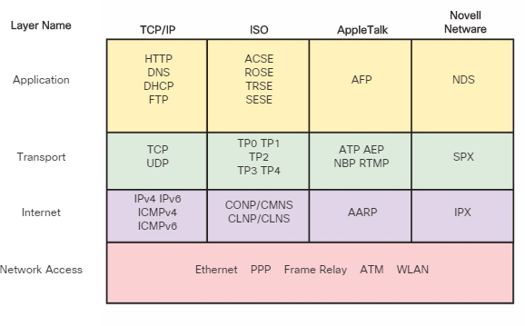

TCP/IP Protocols and Standards

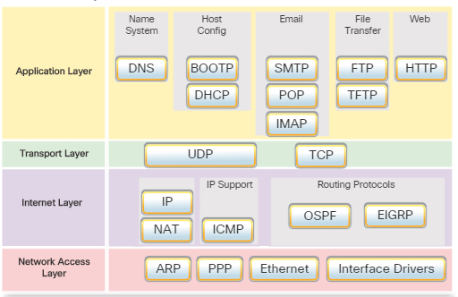

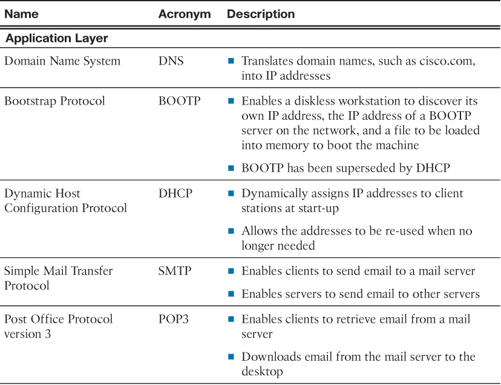
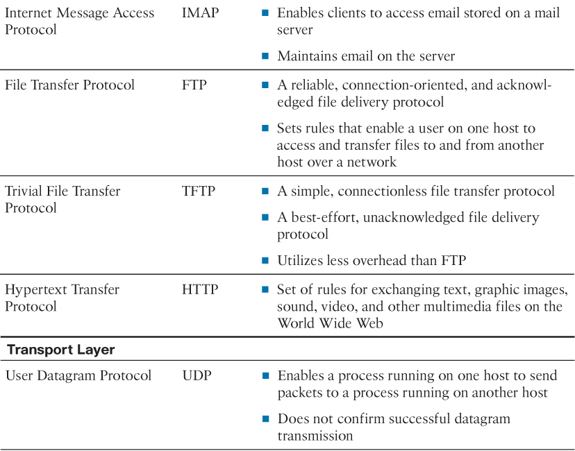
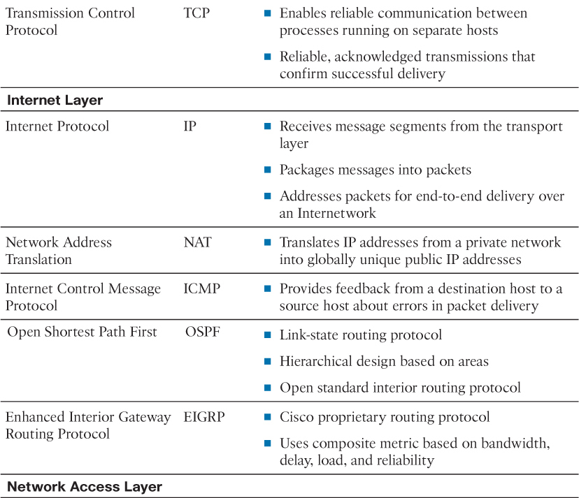

## Standards Organizations

### Internet Standards

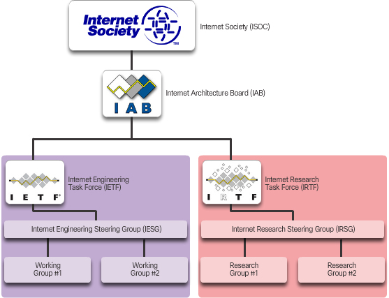

- Internet Society (ISOC) – Responsible for promoting the open development and evolution of Internet use throughout the world.

- Internet Architecture Board (IAB) – Responsible for the overall management and development of Internet standards.

- Internet Engineering Task Force (IETF) – Develops, updates, and maintains Internet and TCP/IP technologies. This includes the process and documents for developing new protocols and updating existing protocols know as Request for Comments (RFC) documents.

- Internet Research Task Force (IRTF) – Focused on long-term research related to Internet and TCP/IP protocols such as Anti-Spam Research Group (ASRG), Crypto Forum Research Group (CFRG), and Peer-to-Peer Research Group (P2PRG).

### IP Standards

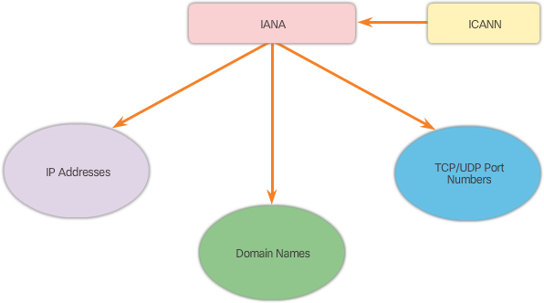

- Internet Corporation for Assigned Names and Numbers (ICANN) – Based in the United States, coordinates IP address allocation, the management of domain names, and assignment of other information used TCP/IP protocols.

- Internet Assigned Numbers Authority (IANA) – Responsible for overseeing and managing IP address allocation, domain name management, and protocol identifiers for ICANN.

### Communications Standard

- Institute of Electrical and Electronics Engineers (IEEE, pronounced “I-triple-E”) – Organization of electrical engineering and electronics dedicated to advancing technological innovation and creating standards in a wide area of industries including power and energy, healthcare, telecommunications, and networking. Standards related to networking belong to the IEEE 802 Working Groups and Study Groups. Common 802 standards include

    - 802.1 Higher Layer LAN Protocols Working Group

    - 802.3 Ethernet Working Group

    - 802.11 Wireless LAN Working Group

    - 802.15 Wireless Personal Area Network (WPAN) Working Group

    - 802.16 Broadband Wireless Access Working Group

    - 802.18 Radio Regulatory TAG

    - 802.19 Wireless Coexistence Working Group

    - 802.21 Media Independent Handover Services Working Group

    - 802.22 Wireless Regional Area Networks

    - 802.24 Smart Grid TAG

- Electronic Industries Alliance (EIA) – Best known for its standards related to electrical wiring, connectors, and the 19-inch racks used to mount networking equipment.

- Telecommunications Industry Association (TIA) – Responsible for developing communication standards in a variety of areas including radio equipment, cellular towers, Voice over IP (VoIP) devices, satellite communications, and more.

- International Telecommunications Union-Telecommunication Standardization Sector (ITU-T) – One of the largest and oldest communication standard organizations. The ITU-T defines standards for video compression, Internet Protocol Television (IPTV), and broadband communications, such as a digital subscriber line (DSL).

## Reference Model

benefits of layered model

- Assisting in protocol design because protocols that operate at a specific layer have defined information that they act upon and a defined interface to the layers above and below.

- Fostering competition because products from different vendors can work together.

- Preventing technology or capability changes in one layer from affecting other layers above and below.

- Providing a common language to describe networking functions and capabilities.

**A networking model is only a representation of a network operation. the model is not the actual network**

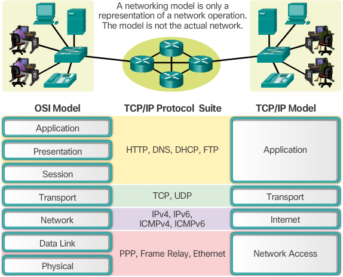

### TCP/IP Model:

describe the function of specific protocol at each layer. 
closesly associated with protocol implementation

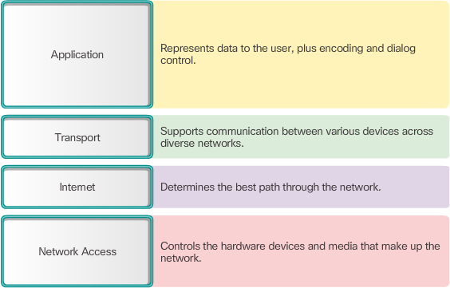

### OSI Model:
Open Systems Interconnection 

ignorant of specific protocols
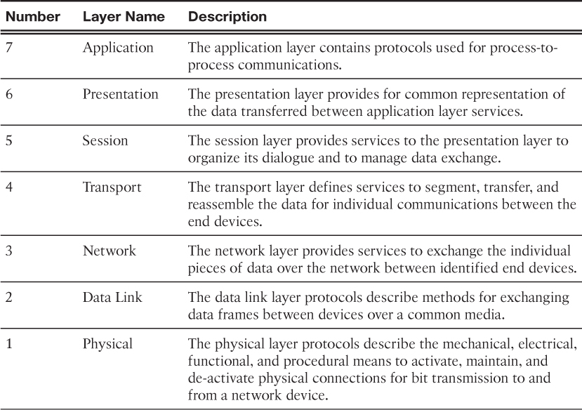

## Data Transfer in the Network

- Data Encapsulation 

- Message Segmentation
    - Segmentation can increase the efficiency of network communications. 

- Protocol Data Unit

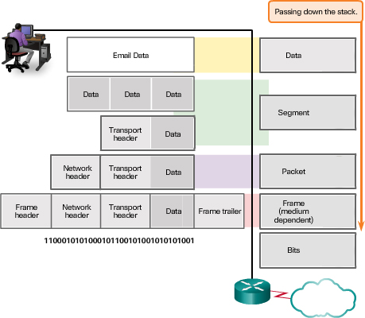

- Network Address
    -  Network layer source and destination addresses – Responsible for delivering the IP packet from the original source to the final destination, either on the same network or to a remote network.

    - Data link layer source and destination addresses – Responsible for delivering the data link frame from one network interface card (NIC) to another NIC on the same network. 总是相邻的

## Check Your Understanding Questions

1. Which of the following elements do both human and computer communication systems have in common? (Choose three.)
(A, C, E)

A. Source

B. Keyboard

C. Channel

D. Default gateway

E. Receiver

2. What happens to frames that are too long or too short(?) for the channel used?
(A) _> (B) they are already frames

A. They are broken up into smaller pieces.

B. They are dropped.

C. They clog the network and block the delivery of other frames.

D. They are returned to the sender.

E. They are delivered but much slower than proper-size frames.

3. Which message timing factor impacts how much information can be sent and the speed at which it can be delivered?
(C)

A. Access method (when can send)

B. Delay speed

C. Flow control

D. Response timeout

4. What is the name given to a one-to-many message delivery option?
(B)

A. Unicast

B. Multicast

C. Broadcast

D. Manycast

5. What name is given to a group of interrelated protocols necessary to perform a communication function?
(C)

A. Functional collection

B. Functional protocol

C. Protocol suite

D. Protocol stack

6. What type of protocol describes communication over a data link and the physical transmission of data on the network media?
(D)

A. Application protocol

B. Transport protocol

C. Internet protocol

D. Network access protocol

7. Which of the following are examples of proprietary protocols? (Choose two.)
(C, D)

A. TCP/IP

B. ISO

C. AppleTalk

D. Novell NetWare

8. Which organization is responsible for the standard that defines Media Access Control for wired Ethernet?
(D)

A. ISOC

B. IAB

C. IETF

D. IEEE

E. ISO

9. What organization is responsible for the overall management and development of Internet standards?
(B) -> (A)

A. IAB

B. IETF - TCP/IP, RFC ...

C. IRTF

D. IEEE

E. ISO

10. Which organization is responsible for developing communications standards for Voice over IP (VoIP) devices?
(B)

A. The Electronics Industry Alliance (EIA)

B. The Telecommunications Industry Association (TIA)

C. The International Telecommunications Union-Telecommunications Standardization Sector (ITU-T)

D. The Internet Corporation for Assigned Names and Numbers (ICANN)

11. Which of the following TCP/IP protocols exist at the transport layer of the TCP/IP reference model? (Choose two.)
(C, E)

A. HTTP

B. FTP

C. TCP

D. DNS

E. UDP

12. Which of the following OSI model layers have the same functionality as the network access layer in the TCP/IP model? (Choose two.)
(D, F)

A. Application

B. Transport

C. Session

D. Physical

E. Presentation

F. Data link

G. Network

13. Which OSI reference model layer is responsible for common representation of the data transferred between application layer services?
(E)

A. Application

B. Transport

C. Session

D. Physical

E. Presentation

F. Data link

G. Network

14. Which TCP/IP model layer is responsible for providing the best path through the network?
(C)

A. Application

B. Transport

C. Internet

D. Network Access

15. Which application layer protocol allows users on one network to reliably transfer files to and from a host on another network?
(B)

A. HTTP

B. FTP

C. IMAP

D. TFTP

E. DHCP

16. What is the transport layer PDU?
(B)

A. Data

B. Segment

C. Packet

D. Frame

E. Bit

17. What is the correct order of data de-encapsulation?
(C)

A. Data > segment > packet > frame > bit

B. Bit > frame> segment > packet > data

C. Bit > frame > packet > segment > data

D. Data > frame > packet > segment > bit

E. Bit > packet > frame > segment > data

18. What pieces of information are required for a host to access resources on the local network? (Choose three.)
(A, B, C)

A. Physical address

B. Network address

C. Process number (port)

D. Default gateway address

E. Host name

19. What pieces of information are required for a host to access resources on a remote network? (Choose four.)
(A, B, C, D)

A. Physical address

B. Network address

C. Process number (port)

D. Default gateway address

E. Host name

20. What are some of the four major responsibilities of network protocols?

- identify sender and receiver
- data format definition
- flow control
- acknowledgement