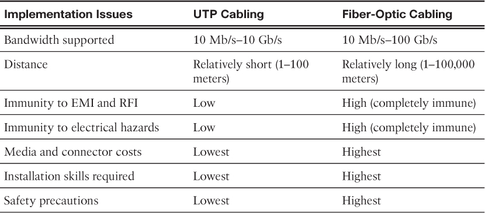

On the sending device, 

it is the role of the data link layer to **prepare data for transmission** and **control how that data accesses the physical media**. 
However, the physical layer controls how the data is transmitted onto the physical media by encoding the binary digits that represent data into signals.

On the receiving end, 

the physical layer receives signals across the connecting media. After decoding the signal back into data, the physical layer passes the frame to the data link layer for acceptance and processing.

### Physical Layer Functions

Encoding

Encoding or line encoding is a method of converting a stream of data bits into a predefined “code.” **Codes are groupings of bits used to provide a predictable pattern** that can be recognized by both the sender and the receiver.

manchester encoding - voltage

Signaling

The physical layer must generate the electrical, optical, or wireless signals that represent the “1” and “0” on the media. **The method of representing the bits is called the signaling method**. The physical layer standards must define what type of signal represents a “1” and what type of signal represents a “0.” This can be as simple as a change in the level of an electrical signal or optical pulse. For example, a long pulse might represent a 1, whereas a short pulse represents a 0.

Modulation

Modulation is the process by which the characteristic of one wave (the signal) **modifies** another wave (the carrier).

Bandwidth

Bandwidth is the capacity of a medium to carry data. (factors)
- The properties of the physical media
- The technologies chosen for signaling and detecting network signals

Throughput

Throughput is the measure of the transfer of bits across the media over a given period of time.

factors
- The amount of traffic
- The type of traffic
- The latency created by the number of network devices encountered between source and destination

## Network Media

### Copper cable – The signals are patterns of electrical pulses.

Data is transmitted on copper cables as **electrical pulses**. 

A **detector** in the network interface of a destination device must receive a signal that can be successfully decoded to match the signal sent. 

However, the longer the signal travels, the more it deteriorates. This is referred to as **signal attenuation**. 

The timing and voltage values of the electrical pulses are also susceptible to interference from two sources:

- Electromagnetic interference (EMI) or radio frequency interference (RFI) – EMI and RFI signals can distort and corrupt the data signals being carried by copper media. Potential sources of EMI and RFI include radio waves and electromagnetic devices, such as fluorescent lights or electric motors, as shown in the figure.

- Crosstalk – Crosstalk is a disturbance caused by the electric or magnetic fields of a signal on one wire to the signal in an adjacent wire. (some types of copper cables have opposing circuit wire pairs twisted together, which effectively cancels the crosstalk.)

types of copper cable

- Unshielded Twisted-Pair (UTP) - RJ-45
- Shielded Twisted-Pair (STP) better noise protection
- Coaxial

T568A
T568B

### Fiber-optic cable – The signals are patterns of light.

Optical fiber cable transmits data over longer distances and at higher bandwidths than any other networking media. Unlike copper wires, fiber-optic cable can transmit signals with less attenuation and is completely immune to EMI and RFI. Optical fiber is commonly used to interconnect network devices

Bits are encoded on the fiber as light impulses. 

Light pulses are generated by either

- Lasers
- Light emitting diodes (LEDs)

Electronic semiconductor devices called **photodiodes** detect the light pulses and convert them to voltages.

Fiber-optic cables are broadly classified into two types:

- Single-mode fiber (SMF) 

- Multimode fiber (MMF)

Because light can only travel in one direction over optical fiber, two fibers are required to support the **full duplex** operation. Therefore, fiber-optic patch cables bundle together two optical fiber cables and terminate them with a pair of standard single fiber connectors

A **yellow** jacket is for single-mode fiber cables and 
**orange** (or aqua) for multimode fiber cables.

fiber vs copper

### Wireless – The signals are patterns of microwave transmissions.

Wireless media carry **electromagnetic signals** using radio or microwave frequencies.

Wireless does have some areas of concern, including

- Coverage area – certain construction materials used in buildings and structures, and the local terrain, will limit the effective coverage.

- Interference – can be disrupted by such common devices as household cordless phones, some types of fluorescent lights, microwave ovens, and other wireless communications.

- Security – Wireless communication coverage requires no access to a physical strand of media. Therefore, devices and users, not authorized for access to the network, can gain access to the transmission. Network security is a major component of wireless network administration.

- Shared medium – WLANs operate in half-duplex, which means **only one device can send or receive at a time**. The wireless medium is shared among all wireless users. The more users needing to access the WLAN simultaneously results in less bandwidth for each user. Half-duplex is discussed later in this chapter.

Types of Wireless Media

- WiFi (IEEE 802.11 standard) – Wireless LAN (WLAN) technology, commonly referred to as Wi-Fi. WLAN uses a contention-based protocol known as Carrier Sense Multiple Access/Collision Avoidance (CSMA/CA). The wireless NIC must first listen before transmitting to determine if the radio channel is clear. If another wireless device is transmitting, then the NIC must wait until the channel is clear.

- Bluetooth (IEEE 802.15 standard) – Wireless Personal Area Network (WPAN) standard, commonly known as “Bluetooth,” uses a device-pairing process to communicate over distances from 1 to 100 meters.

- Wi Max (IEEE 802.16 Standard) – Commonly known as Worldwide Interoperability for Microwave Access (WiMAX), uses a point-to-multipoint topology to provide wireless broadband access.

- cellular and satellite communications are out of scope for this chapter.

**physical layer specifications** are applied to areas that include

- Data-to-radio signal encoding
- Frequency and power of transmission
- Signal reception and decoding requirements
- Antenna design and construction

Wireless Access Point (AP)

Concentrates the wireless signals from users and connects to the existing copper-based network infrastructure, such as Ethernet. 

Home and small business wireless routers integrate the functions of a router, switch, and access point into one device

Wireless NIC adapters

Provide wireless communication capability to each network host.

## Data Link Layer Protocol

responsible for

- Allowing the upper layers to access the media
- Accepting Layer 3 packets and packaging them into frames
- Preparing network data for the physical network
- Controlling how data is placed and received on the media
- Exchanging frames between nodes over a physical network media, such as UTP or fiber-optic
- Receiving and directing packets to an upper layer protocol
- Performing error detection

The data link layer is divided into two sublayers:

- Logical Link Control (LLC) – This upper sublayer communicates with the network layer. It places information in the frame that identifies which network layer protocol is being used for the frame. This information allows multiple Layer 3 protocols, such as IPv4 and IPv6, to utilize the same network interface and media.
- Media Access Control (MAC) – This lower sublayer defines the media access processes performed by the hardware. It provides data link layer addressing and access to various network technologies.

## Media Access Control

The technique used for getting the frame on and off the media is called the **media access control method**.

### Media Access Control Methods

- Contention-based access - half-duplex, one send at a time

Carrier Sense Multiple Access/Collision Detection (CSMA/CD) 

If two devices transmit at the same time, a collision will occur. Both devices will detect the collision on the network; this is the collision detection (CD). This is done by the NIC comparing data transmitted with data received or by recognizing the signal amplitude is higher than normal on the media. The data sent by both devices will be corrupted and will need to be resent.

 Carrier Sense Multiple Access/Collision Avoidance (CSMA/CA)

CSMA/CA does not detect collisions but attempts to avoid them by waiting before transmitting.
Each device that transmits includes the time duration that it needs for the transmission. All other wireless devices receive this information and know how long the medium will be unavailable

contention-based systems **do not scale well** under heavy media use

It is important to note that Ethernet LANs using switches do not use a contention-based system because the switch and the host NIC operate in full-duplex mode.

- Controlled access - take turns

### Frame

- Type – Identifies the Layer 3 protocol in the data field.
- Control – Identifies special flow control services such as quality of service (QoS). QoS is used to give forwarding priority to certain types of messages. Data link frames carrying voice over IP (VoIP) packets normally receive priority because they are sensitive to delay.

the physical address is unique to the specific device. If the device is moved to another network or subnet, it will still function with the same Layer 2 physical address.

## Check Your Understanding Questions

1. What are the purpose and functions of the physical layer in data networks? (Choose two.)
(A, B)

A. Controls how the data is transmitted onto the physical media

B. Encodes the data into signals

C. Provides logical addressing

D. Packages bits into data units

E. Controls media access

2. Which of these statements regarding UTP network cabling are true? (Choose two.)
(B, E)

A. Uses light to transmit data

B. Susceptible to EMI and RFI

C. Commonly used between buildings

D. Most difficult type of networking cable to install

E. Most commonly used type of networking cable

3. What is the purpose of cladding in fiber-optic cables?
(C)

A. Cable grounding

B. Noise cancellation

C. Prevention of light loss by keeping light in the core

D. EMI protection

4. Which statement describes a characteristic of the frame header fields of the data link layer?
(C)

A. They all include the flow control and logical connection fields.

B. Ethernet frame header fields contain Layer 3 source and destination addresses.

C. They vary depending on protocols.

D. They include information on user applications.

5. What are the advantages of using fiber-optic cable over copper cable? (Choose three.)
(B, D, F)

A. Copper is more expensive.

B. Immunity to electromagnetic interference.

C. Careful cable handling.

D. Longer maximum cable length.

E. Efficient electrical current transfer.

F. Greater bandwidth potential.

6. What occurs when another wireless device connects to a wireless access point (WAP)?
(B)

A. The WAP adds an additional channel to support the new client.

B. The WAP throughput for all the connected clients decreases.

C. The WAP decreases the radio coverage area.

D. The WAP will change frequencies to reduce interference caused by the new client.

7. Which is a function of the Logical Link Control (LLC) sublayer?
(C)

A. To define the media access processes that are performed by the hardware

B. To provide data link layer addressing

C. To identify which network layer protocol is being used

D. To accept segments and package them into data units that are called packets

8. What are the contents of the data field in a frame?
(B)

A. A CRC

B. The network layer PDU

C. The Layer 2 source address

D. The length of the frame

9. Which of the following is true about the logical topology of a network?
(D)

A. Is always multi-access (Some network topologies share a common medium with multiple nodes.)

B. Provides the physical addressing

C. Is determined by how the nodes in the network are connected

D. Defines how frames are transferred from one node to the next

10. Which of the following is a characteristic of contention-based MAC?
(B)

A. Used in point-to-point topologies.

B. Nodes compete for the use of the medium.

C. Leaves MAC to the upper layer.

D. Each node has a specific time to use the medium.