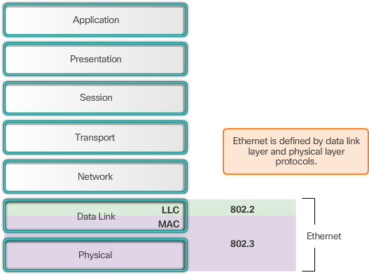
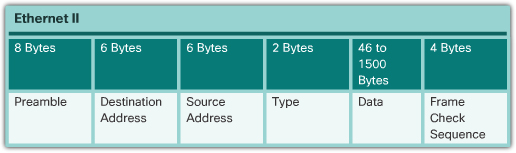
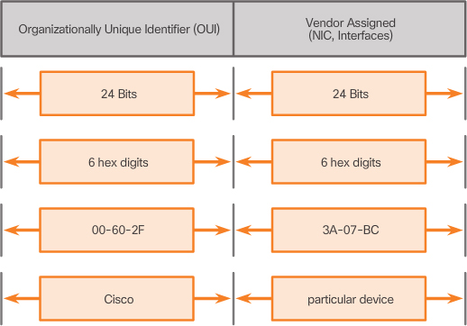
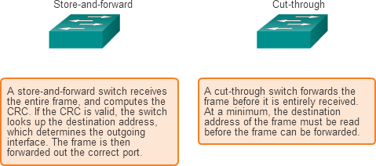
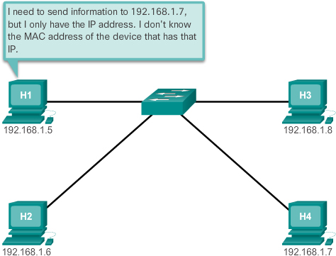
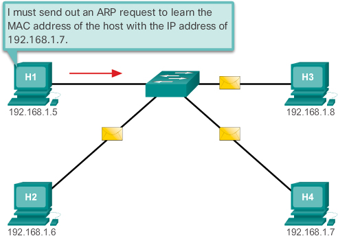
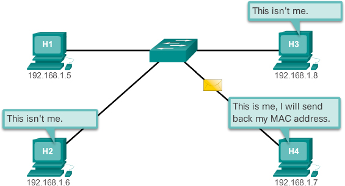
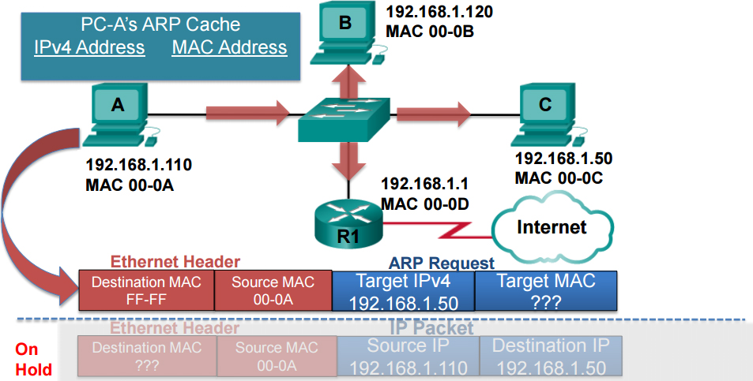
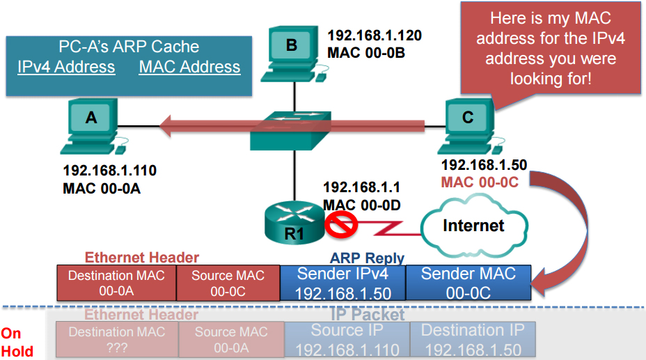
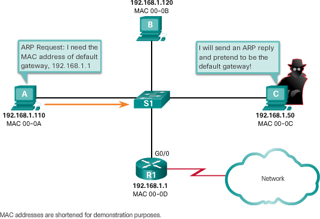

Ethernet operates in the data link layer and the physical layer. 
It is a family of networking technologies that are defined in the IEEE 802.2 and 802.3 standards.

只要还是 bits(1 or 0) 应该都还在 data link layer
- logical link sublayer: 负责与上层互动
- media access sublayer：负责与下层交互
    - data encapsulation
        - frame delimiting
        - addressing
        - error detection
    - media access control


 ## Ethernet Protocol

Ethernet is an implementation of Network Access



 ### Ethernet Frame

The underlying logical topology of Ethernet is a multi-access bus

The Carrier Sense Multiple Access/Collision Detection (CSMA/CD) process is used in half-duplex Ethernet LANs

Today’s Ethernet LANs use full-duplex switches, which allow multiple devices to send and receive simultaneously with no collisions.


Ethernet II is the Ethernet frame format used in TCP/IP networks.




frame size

runt frame < 64 bytes -- 1518 bytes < jumbo frame

both  likely to be the result of collisions or other unwanted signals and are therefore considered invalid.


fields

- Preamble – The Preamble (7 bytes) and Start Frame Delimiter (SFD), also called the Start of Frame (1 byte), fields are used for synchronization between the sending and receiving devices. These first eight bytes of the frame are used to get the attention of the receiving nodes. Essentially, the first few bytes tell the receivers to get ready to receive a new frame.

- EtherType Field – This 2-byte field identifies the upper layer protocol encapsulated in the Ethernet frame. Common values are, in hexadecimal, 0 × 800 for **IPv4**, 0 × 86DD for **IPv6** and 0 × 806 for **ARP**.

- FCS – The Frame Check Sequence (FCS) field (4 bytes) is used to detect errors in a frame. It uses a cyclic redundancy check (CRC). The sending device includes the results of a CRC in the FCS field of the frame. The receiving device receives the frame and generates a CRC to look for errors. If the calculations match, no error occurred. Calculations that do not match are an indication that the data has changed; therefore, the frame is dropped. A change in the data could be the result of a disruption of the electrical signals that represent the bits.


 ### Ethernet MAC Address

An Ethernet MAC address is a 48-bit binary value expressed as 12 hexadecimal digits (4 bits per hexadecimal digit).

The MAC address value is a direct result of IEEE-enforced rules for vendors to ensure **globally unique addresses** for each Ethernet device. 

The rules established by IEEE require any vendor that sells Ethernet devices to register with IEEE. The IEEE assigns the vendor a 3-byte (24-bit) code, called the Organizationally Unique Identifier (OUI).




broadcast MAC addr: FF-FF-FF-FF-FF-FF 
multicast MAC addr: start with 01-00-5E


## LAN Switches

 The switch makes its forwarding decisions based only on the Layer 2 Ethernet MAC addresses.

 If the destination MAC address is not in the table, the switch will forward the frame out all ports except the incoming port. 
 This is known as an **unknown unicast**.
 
 好像 MAC Addr Table 只有通过 incoming frame (source addr) 来更新内容 (MAC addr <-> port)


### Switch Forwarding Methods

Switches use one of the following forwarding methods for switching data between network ports:
- Store-and-forward switching
- Cut-through switching




There are two variants of cut-through switching:

- Fast-forward switching – Fast-forward switching offers the lowest level of latency. Fast-forward switching immediately forwards a packet after reading the destination address. Because fast-forward switching starts forwarding before the entire packet has been received, there may be times when packets are relayed with errors. This occurs infrequently, and the destination network adapter discards the faulty packet upon receipt. In fast-forward mode, latency is measured from the first bit received to the first bit transmitted. Fast-forward switching is the typical cut-through method of switching.

- Fragment-free switching – In fragment-free switching, the switch stores the first 64 bytes of the frame before forwarding. Fragment-free switching can be viewed as a compromise between store-and-forward switching and fast-forward switching. The reason fragment-free switching stores only the first 64 bytes of the frame is that most network errors and collisions occur during the first 64 bytes. Fragment-free switching tries to enhance fast-forward switching by performing a small error check on the first 64 bytes of the frame to ensure that a collision has not occurred before forwarding the frame. Fragment-free switching is a compromise between the high latency and high integrity of store-and-forward switching, and the low latency and reduced integrity of fast-forward switching.


## Address Resolution Protocol

 relationship between MAC and IP addresses, 
 and the how the Address Resolution Protocol (ARP) is used to map the two addresses.

 Ethernet MAC addresses are used to deliver the frame from one NIC to another NIC on **the same network**. 
 
 If the destination IP address is on the same network, **the destination MAC address will be that of the destination device**.

 When the destination IP address is on a remote network, the **destination MAC address will be the address of the host’s default gateway**


Sometimes, a device will not know the destination MAC address




ARP provides two basic functions:
- Resolving IPv4 addresses to MAC addresses
- Maintaining a table of mappings


When a packet is sent to the data link layer to be encapsulated into an Ethernet frame, the device refers to a table in its memory to find the MAC address that is mapped to the IPv4 address. This table is called the **ARP table** or the ARP cache. The ARP table is stored in the RAM of the device.


If the device locates the IPv4 address, its corresponding MAC address is used as the destination MAC address in the frame. 
If there is no entry is found, then the device sends an ARP request.
ARP requests are **broadcasts**




The destination responds with an ARP reply




ARP request



ARP reply




On a Cisco router
```
Router# show ip arp

Protocol Address Age (min) Hardware Addr Type Interface

Internet 172.16.1.1 - 0060.7027.0301 ARPA Ethernet0/0

Internet 172.16.1.10 0 0090.21B5.B1CB ARPA Ethernet0/0

Internet 172.16.1.100 0 0002.169C.7A07 ARPA Ethernet0/0
```

On a Windows 7 PC
```
C:\> arp -a


Interface: 10.10.10.12 —- 0xb

 Internet Address Physical Address Type

 10.10.10.1 e4-f4-c6-12-2b-c9 dynamic
 ...
 ```


 ### ARP Issues 


 ARP Spoofing

 


 ## Check Your Understanding Questions

1. At which layers of the OSI model does Ethernet function? (Choose two.)
(F, G)

A. Application

B. Presentation

C. Session

D. Transport

E. Network

F. Data link

G. Physical

2. Which standard specifies the Ethernet MAC sublayer functionality in a computer NIC?
(B)

A. IEEE 802.2

B. IEEE 802.3

C. IEEE 802.6

D. IEEE 802.11

E. IEEE 802.15

3. What is the name given to the Ethernet MAC sublayer PDU?
(C)

A. Segment

B. Packet

C. Frame

D. Bit

4. What are the primary functions associated with data encapsulation at the Ethernet MAC sublayer? (Choose three.)
(B, C, E)

A. Media recovery

B. Frame delimiting

C. Addressing

D. Frame placement on the media

E. Error detection

5. What happens when a data collision occurs on an Ethernet bus?
(B)

A. The CRC value is used to repair the data frames.

B. All devices stop transmitting and try again later.

C. The device with the lower MAC address stops transmitting to give the device with the higher MAC address priority.

D. The MAC sublayer prioritizes the frame with the lower MAC address.

6. What is true about the Ethernet MAC address? (Choose three.)
(B, D, E)

A. A MAC address is 32 bits in length. (48)

B. The first 6 hexadecimal digits of a MAC address represent the OUI.

C. The IEEE is responsible for assigning vendors a unique 6-byte code.

D. The vendor is responsible for assigning the last 24 bits of the MAC address.

E. The MAC address is also known as a burned-in address.

7. What is the minimum and maximum Ethernet frame size as defined by IEEE 802.3?
(A)

A. 64 bytes – 1518 bytes

B. 64 bytes – 1522 bytes

C. 32 bytes – 1518 bytes

D. 32 bytes – 1522 bytes

8. Which field in an Ethernet frame is used for error detection?
(D)

A. Preamble

B. Type

C. Destination MAC Address

D. Frame Check Sequence

9. Which address is used as a destination address on a broadcast Ethernet frame?
(C)

A. 0.0.0.0

B. 255.255.255.255

C. FF-FF-FF-FF-FF-FF

D. 0C-FA-94-24-EF-00

10. Which address is a multicast MAC address?
(D) -> (B) All multicast MAC addresses start with 01-00-5E

A. 0-07-E9-00-00-D4

B. 01-00-5E-00-00-C8

C. FF-FF-FF-FF-FF-FF

D. FF-FF-FF-01-00-5E

11. What functions are provided by the ARP process? (Choose two.)
(A, C)

A. Resolving IPv4 addresses to MAC addresses

B. Resolving host names to MAC addresses

C. Maintaining a table of mappings

D. Resolving host names to IP addresses

E. Maintaining a table of active IP addresses

12. Which devices on a network will receive an ARP request?
(B)

A. Only the device that has the IPv4 address that the request is looking for

B. All devices in the L2 broadcast domain

C. Only devices in the same collision domain

13. Fill in the blanks. When ARP receives a request to map an IPv4 address to a MAC address, it first looks in its (ARP table). If no entry is found, ARP will send out an ARP (request).
ARP request 就在 ARP table 查询
普通 frame 才在 MAC addr table 查询

14. Fill in the blanks. When a device receives an ARP request for a device with a different IP address, it will use the (source) information to update its ARP table and then it will (drop) the packet.
本来就是 broadcast 所以不用 forward

15. Fill in the blanks. ARP (requests) are sent to a broadcast MAC address, and ARP replies are sent to a (unicast) MAC address.

16. Fill in the blanks. When a switch receives a broadcast frame, it enters the source information in its (MAC addr table) and then it (floods) the frame to all ports except the one the frame was (received) on.

17. Fill in the blanks. The MAC address table is sometimes referred to as a (CAM) table because it is stored in (content addressable) memory.

18. What type of switching is used on current L2 switches to allow QoS?
(A) -> (A, C)

A. Store-and-forward

B. Cut-through

C. Fragment-free 是种折衷 但也是QoS的方法

D. Fast-forward

19. If the source and destination IPv4 addresses are on the same network, the destination MAC address will be that of which device?
(A)

A. The same device as the destination IPv4 address

B. The default gateway

C. The Ethernet switch

20. If the source and destination IPv4 addresses are on different networks, the destination MAC address will be that of which device?
(B)

A. The same device as the destination IPv4 address

B. The default gateway

C. The Ethernet switch