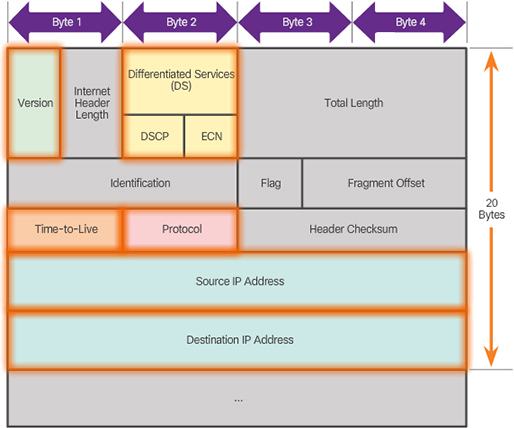
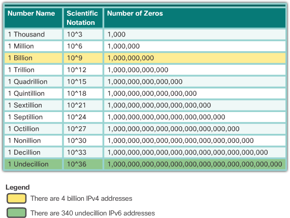
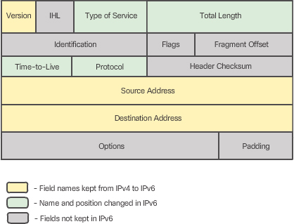
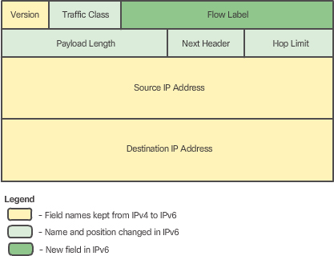
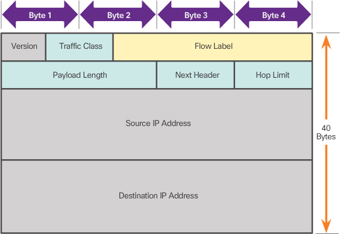
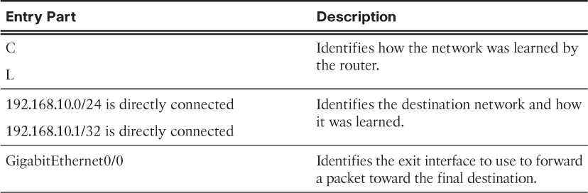
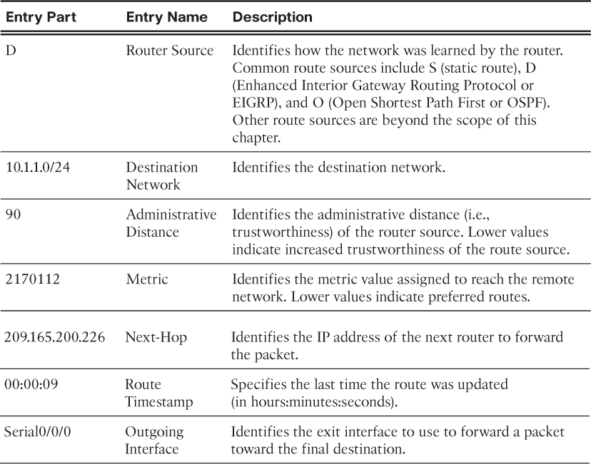

## Network Layer Protocol

The network layer, or OSI Layer 3, provides services to allow end devices to exchange data across the network. 
To accomplish this end-to-end transport, the network layer uses four basic processes:
- Addressing end devices
- Addressing end devices
- Routing
- De-encapsulation


there are only two network layer protocols that are commonly implemented:
- Internet Protocol version 4 (IPv4)
- Internet Protocol version 6 (IPv6)


### Characteristics of IP 

basic characteristics:
- connectionless
    - If the receiver is present
    - If the letter arrived
    - If the receiver can read the letter
- best effort - inherently unreliable
    - Unreliable means that IP does not have the capability to manage and recover from undelivered or corrupt packets.
- media independent
    - There is one major characteristic of the media that the network layer considers: the maximum size of the PDU that each medium can transport. This characteristic is referred to as the **maximum transmission unit** (MTU).
    - In some cases, an intermediate device, usually a router, must split up a packet when forwarding it from one medium to another medium with a smaller MTU. This process is called fragmenting the packet or fragmentation.


### IPv4 Packet




important fields:
- Version – Contains a 4-bit binary value set to 0100 that identifies this as an IP version 4 packet.
- Differentiated Services or DiffServ (DS) – Formerly called the Type of Service (ToS) field, the DS field is an 8-bit field used to determine the **priority** of each packet. The six most significant bits of the DiffServ field is the Differentiated Services Code Point (DSCP) and the last two bits are the Explicit Congestion Notification (ECN) bits.
- Time-to-Live (TTL) – Contains an 8-bit binary value that is used to limit the lifetime of a packet. The packet sender sets the initial TTL value, and it is **decreased** by one each time the packet is processed by a router. If the TTL field decrements to zero, the router discards the packet and sends an Internet Control Message Protocol (ICMP) Time Exceeded message to the source IP address.
- Protocol – Field is used to identify the next level protocol. This 8-bit binary value indicates the data payload type that the packet is carrying, which enables the network layer to pass the data to the appropriate **upper-layer protocol**. Common values include ICMP (1), TCP (6), and UDP (17).
- Source IPv4 Address – Contains a 32-bit binary value that represents the source IPv4 address of the packet. The source IPv4 address is always a unicast address.
- Destination IPv4 Address – Contains a 32-bit binary value that represents the destination IPv4 address of the packet. The destination IPv4 address is a unicast, multicast, or broadcast address.

- The Internet **Header Length (IHL), Total Length, and Header Checksum** fields are used to identify and validate the packet.

- Other fields are used to reorder a fragmented packet. Specifically, the IPv4 packet uses **Identification, Flags, and Fragment Offset** fields to keep track of the fragments. A router may have to fragment a packet when forwarding it from one medium to another with a smaller MTU.

- The Options and Padding fields are rarely used and are beyond the scope of this chapter.


Limitations of IPv4
- IP address depletion
- Internet routing table expansion (? how does IPv6 resolve this)
- Lack of end-to-end connectivity – Network Address Translation (NAT) is a technology commonly implemented within IPv4 networks. NAT provides a way for multiple devices to share a single public IPv4 address. However, because the public IPv4 address is shared, the IPv4 address of an internal network host is hidden. This can be problematic for technologies that require end-to-end connectivity.


IPv4 space vs IPv6 space




IPv6 packet was simplified




### IPv6 Packet





advantages
- Better routing efficiency for performance and forwarding-rate scalability
- No requirement for processing checksums (improve performance, move error detection to higher layer)
- Simplified and more efficient extension header mechanisms (as opposed to the IPv4 Options field)
- A Flow Label field for per-flow processing with no need to open the transport inner packet to identify the various traffic flows


#### IPv6 headers




- Version – This field contains a 4-bit binary value set to 0110 that identifies this as an IP version 6 packet.
- Traffic Class – This 8-bit field is equivalent to the IPv4 **Differentiated Services** (DS) field.
- Flow Label – This 20-bit field suggests that all packets with the same flow label receive the same type of handling by routers.
- Payload Length – This 16-bit field indicates the length of the data portion or payload of the IPv6 packet.
- Next Header – This 8-bit field is equivalent to the IPv4 **Protocol** field. It indicates the data payload type that the packet is carrying, enabling the network layer to pass the data to the appropriate upper-layer protocol.
- Hop Limit – This 8-bit field replaces the IPv4 **TTL** field. This value is decremented by a value of 1 by each router that forwards the packet. When the counter reaches 0, the packet is discarded, and an ICMPv6 Time Exceeded message is forwarded to the sending host, indicating that the packet did not reach its destination because the hop limit was exceeded.
- Source IPv6 Address – This 128-bit field identifies the IPv6 address of the sending host.
- Destination IPv6 Address – This 128-bit field identifies the IPv6 address of the receiving host.
- Extension headers are optional and are placed between the IPv6 header and the payload


## Routing


Routing is the process of identifying the best path to a destination. The router connected to the local network segment is referred to as the default gateway.


The functions provided by the default gateway are as follows:
- Routes traffic to other networks
- Has a local IP address in the same address range as other hosts on the network
- Can take data in and forward data out


The routing table of a **router** can store information about
- Image Directly-connected routes – These routes come from the active router interfaces. Routers add a directly connected route when an interface is configured with an IP address and is activated. Each of the router’s interfaces is connected to a different network segment.
- Remote routes – These routes come from remote networks connected to other routers. Routes to these networks can be manually configured on the local router by the network administrator or dynamically configured by enabling the local router to exchange routing information with other routers using a dynamic routing protocol.
- Default route – Like a host, routers also use a default route as a last resort if there is no other route to the desired network in the routing table.


```
C 192.168.10.0/24 is directly connected, GigabitEthernet0/0

L 192.168.10.1/32 is directly connected, GigabitEthernet0/0
```



```
D 10.1.1.0/24 [90/2170112] via 209.165.200.226, 00:00:09, Serial0/0/0
```



In-band interfaces receive and forward IP packets. Every configured and active interface on the router is a member or host on a different IP network. Each interface must be configured with an IPv4 address and subnet mask of a different network. The Cisco IOS does not allow two active interfaces on the same router to belong to the same network.


## Configure a Cisco Router


## Check Your Understanding Questions

1. Which layer of the OSI model is concerned with end-to-end communication over the network?
(A)

A. Network

B. Transport

C. Data link

D. Application

2. Which of the following is associated with the network layer?
(A)

A. IP address

B. Frames

C. MAC address

D. Physical addressing

3. Why was IPv4 designed as a connectionless protocol?
(network layer does not care about end-to-end connection) -> connectionless to reduce overhead

4. On a router, what field in an IPv4 header should be examined to determine that the maximum number of hops has been reached by the packet on its way from the source to this destination?
(C)

A. Version

B. DS

C. TTL

D. Protocol

E. Source IPv4 Address

F. Destination IPv4 Address

5. When configuring a host, the gateway was not configured. How will this affect communication to and from this device?
(C)

A. Host communication will not be affected.

B. The host will not be able to communicate with devices by name.

C. Communication will be limited to hosts in the local network.

D. No communication will be successful to or from the host.

6. In what part of a router is the running configuration being used located?
(D)

A. ROM

B. NVRAM

C. Flash

D. RAM

7. During the boot process of a Cisco router, you notice a series of hash symbols (#) appearing on the terminal emulator screen from the console session. In what phase is the boot process?
() -> (B)

A. Loading the startup configuration

B. Loading the IOS

C. POST

D. Loading the bootstrap

8. What are the required steps for configuring an interface on a router? (Choose two.)
(A, D)

A. Provide Layer 3 addressing information

B. Add a description to the interface

C. Turn on routing on the interface

D. Activate the interface

9. The ip default-gateway command was not used when configuring a switch. How will this affect network communication? (Choose two.)
(C, E) -> (A, E)

A. Host communication through the switch will not be affected.

B. The hosts communicating through the switch will not be able to communicate with devices by name.

C. The **host communication** through the switch will be limited to hosts in the local network. ( A common misconception is that the switch uses its configured default gateway address to determine where to forward packets originating from hosts connected to the switch and destined for hosts on a remote network.)

D. No communication through the switch will be successful.

E. Communication to and from the switch will be limited to hosts in the local network. (**Actually, the IP address and default gateway information are only used for packets that originate from the switch.**)

10. When using the netstat -r command on a host, you see a route 0.0.0.0 0.0.0.0. What does this route represent?
(C)

A. The host has no routes available for forwarding packets.

B. This is a route for testing local communication.

C. Destinations without a specified route are forwarded to the gateway.

D. The host does not have an IP address configured.