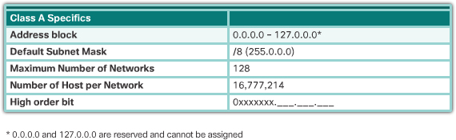
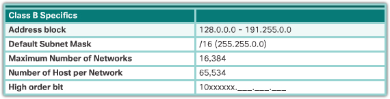
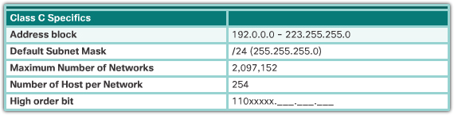
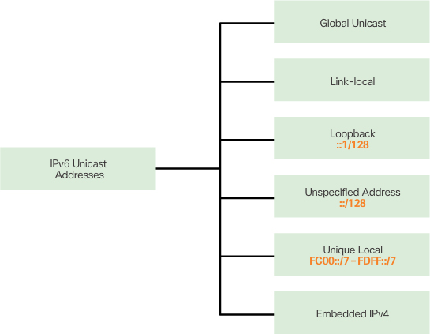
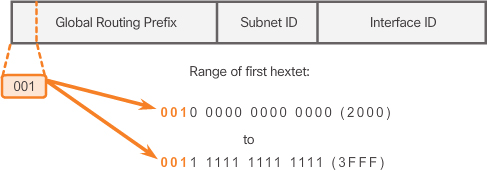
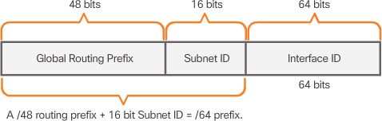

## IPv4 Network Address

With a **broadcast**, the packet contains a destination IPv4 address with **all ones (1s) in the host portion**. 

A **limited broadcast** is sent to 255.255.255.255. its own network?

By default
routers do not forward broadcasts.

IPv4 has reserved the 224.0.0.0 to 239.255.255.255 addresses as a multicast range. 
addresses 224.0.0.0 to 224.0.0.255 are reserved for multicasting on the local network only. 

A router connected to the local network recognizes that these packets are addressed to a local network multicast group and never forwards them further.

Specifically, the private address blocks are
- 10.0.0.0 /8 or 10.0.0.0 to 10.255.255.255
- 172.16.0.0 /12 or 172.16.0.0 to 172.31.255.255
- 192.168.0.0 /16 or 192.168.0.0 to 192.168.255.255

it is important to know that addresses within these address blocks are not allowed on the Internet and must be filtered (discarded) by Internet routers

special user address
- Loopback addresses - 127.0.0.1
- Link-Local addresses (169.254.0.0 /16 or 169.254.0.1 to 169.254.255.254) – More commonly known as the Automatic Private IP Addressing (APIPA) addresses, they are used by a Windows DCHP client to self-configure in the event that there are no DHCP servers available. Useful in a peer-to-peer connection.
- TEST-NET addresses (192.0.2.0/24 or 192.0.2.0 to 192.0.2.255) – These addresses are set aside for teaching and learning purposes and can be used in documentation and network examples.

#### classful addressing

- class A 

- class B

- class C

#### classless addressing

The problem is that this wasted a great deal of addresses and exhausted the availability of IPv4 addresses. Not all organizations’ requirements fit well into one of these three classes

The IETF knew that CIDR was only a temporary solution and that a new IP protocol would have to be developed to accommodate the rapid growth in the number of Internet users. In 1994, the IETF began its work to find a successor to IPv4, which eventually became IPv6.

Both IPv4 and IPv6 addresses are managed by the Internet Assigned Numbers Authority (IANA) (http://www.iana.org). 

Regional Internet Registries (RIRs). The RIRs are as follows:
- American Registry for Internet Numbers (ARIN) – manages and maintains IPv4 and IPv6 addresses for North America. For more information, go to http://www.arin.net
- Réseaux IP Europeans (RIPE) – manages and maintains IPv4 and IPv6 addresses for Europe, the Middle East, and Central Asia; http://www.ripe.net
- Asia Pacific Network Information Centre (APNIC) – manages and maintains IPv4 and IPv6 addresses for the Asia and Pacific regions including Australia. For more information, go to http://www.apnic.net
- African Network Information Centre (AfriNIC) – manages and maintains IPv4 and IPv6 addresses for Africa. For more information, go to http://www.afrinic.net
- Regional Latin-American and Caribbean IP Address Registry (LACNIC) – manages and maintains IPv4 and IPv6 addresses for Latin America and some Caribbean islands. For more information, go to http://www.lacnic.net

## IPv6 Network Address

The migration techniques can be divided into three categories (IPv4 -> IPv6)
- Dual Stack – As shown in Figure 7-35, dual stack allows IPv4 and IPv6 to coexist on the same network segment. Dual stack devices run both IPv4 and IPv6 protocol stacks simultaneously.
- Tunneling – As shown in Figure 7-36, tunneling is a method of transporting an IPv6 packet over an IPv4 network. The IPv6 packet is encapsulated inside an IPv4 packet, similar to other types of data.
- Translation – As shown in Figure 7-37, Network Address Translation 64 (NAT64) allows IPv6-enabled devices to communicate with IPv4-enabled devices using a translation technique similar to NAT for IPv4. An IPv6 packet is translated to an IPv4 packet and vice versa.

IPv6 Address Types
- Unicast – An IPv6 unicast address uniquely identifies an interface on an IPv6-enabled device. a source IPv6 address must be a unicast address.
- Multicast – An IPv6 multicast address is used to send a single IPv6 packet to multiple destinations.
- Anycast – An IPv6 anycast address is any IPv6 **unicast** address that can be assigned to multiple devices. A packet sent to an anycast address is routed to the nearest device having that address.

#### unicast

- Global unicast
A global unicast address is similar to a public IPv4 address. These are globally unique, Internet-routable addresses. Global unicast addresses can be configured statically or assigned dynamically.
- Link-local
Link-local addresses are used to communicate with other devices on the same local link. IPv6 link-local addresses are in the FE80::/10 range. The /10 indicates that the first 10 bits are 1111 1110 10xx xxxx. The first hextet has a range of 1111 1110 1000 0000 (FE80) to 1111 1110 1011 1111 (FEBF).
- Unique local 
Another type of unicast address is the unique local unicast address. IPv6 unique local addresses have some similarity to RFC 1918 private addresses for IPv4, but there are significant differences. Unique local addresses are used for **local addressing within a site** or between a limited number of sites. These addresses should not be routable in the global IPv6 and should not be translated to a global IPv6 address. Unique local addresses are in the range of FC00::/7 to FDFF::/7.

Typically, it is the link-local address of the router, and not the global unicast address, that is used as the **default gateway** for other devices on the link.

link local vs unique local

- Scope:
    - Link-Local Unicast: These addresses have a scope limited to the local link or network segment. They are used for communication between devices on the same network segment and are not meant to be routed beyond that segment.
    - Unique Local Unicast: These addresses are intended for private, internal networks. They have a global scope within the organization or network where they are used but are not meant to be routable on the global internet.

- Address Format:
    - Link-Local Unicast: These addresses are automatically configured and are based on the device's MAC (Media Access Control) address, making them unique on a specific link. They have a prefix of fe80::/10.
    - Unique Local Unicast: These addresses are manually or locally configured and are designed to be unique within a specific organization or network. They use the prefix fc00::/7 with a 40-bit random global ID to ensure uniqueness within the defined scope.

- Purpose:
    - Link-Local Unicast: Primarily used for neighbor discovery and address autoconfiguration on the local network segment. They are used for tasks like router advertisement and solicitation, neighbor solicitation, and duplicate address detection.
    - Unique Local Unicast: Intended for private, internal communication within an organization's network. They can be used for applications and services that do not need globally routable IP addresses but still require unique addressing within the organization.

IPv6 structure

Unlike IPv4, in IPv6, the all-0s and all-1s host addresses can be assigned to a device. The all-1s address can be used due to the fact that broadcast addresses are not used within IPv6. The all-0s address can also be used but is reserved as a Subnet-Router anycast address, and should be assigned only to routers.

#### Dynamic Configuration – SLAAC

Stateless Address Autoconfiguration (SLAAC) is a method that allows a device to obtain its prefix, prefix length, default gateway address, and other information from an IPv6 router without the use of a DHCPv6 server. Using SLAAC, devices rely on the local router’s ICMPv6 Router Advertisement (RA) messages to obtain the necessary information.

IPv6 routers periodically send out ICMPv6 RA messages, every 200 seconds, to all IPv6-enabled devices on the network. An RA message will also be sent in response to a host sending an ICMPv6 Router Solicitation (RS) message.

The ICMPv6 RA message is a suggestion to a device on how to obtain an IPv6 global unicast address. The ultimate decision is up to the device’s operating system. 

The ICMPv6 RA message includes
- Network prefix and prefix length – Tells the device which network it belongs to.
- Default gateway address – This is an IPv6 link-local address, the source IPv6 address of the RA message.
- DNS addresses and domain name – Addresses of DNS servers and a domain name.

there are three options for RA messages:
- Option 1: SLAAC – “I’m everything you need (Prefix, Prefix-length, Default Gateway)”
    - the RA message suggests that the receiving device use the information in the RA message to **create its own IPv6 global unicast address** and for all other information. The services of a **DHCPv6 server are not required**.
- Option 2: SLAAC with a stateless DHCPv6 server – “Here is my information but you need to get other information such as DNS addresses from a DHCPv6 server.”
    - A stateless DHCPv6 server distributes **DNS** server addresses and domain names. It does not allocate global unicast addresses.
- Option 3: Stateful DHCPv6 (no SLAAC) – “I can’t help you. Ask a DHCPv6 server for all your information, except for the default gateway address.”
    - An RA with option 3 (DHCPv6 Only) will require the client to obtain all the information from a DHCPv6 server except the default gateway address. 

#### multicast

IPv6 multicast addresses have the prefix FF00::/8.

assigned (predefined)
- FF02::1 All-nodes multicast group
- FF02::2 All-routers multicast group

## Connectivity Verification

## ICMP

ICMP messages common to both ICMPv4 and ICMPv6 include

- Host confirmation: An ICMP Echo Message can be used to determine if a host is operational. The local host sends an ICMP Echo Request to a host. If the host is available, the destination host responds with an Echo Reply. This use of the ICMP Echo messages is the basis of the ping utility.

- Destination or Service Unreachable: When a host or gateway receives a packet that it cannot deliver, it can use an ICMP Destination Unreachable message to notify the source that the destination or service is unreachable. The message will include a code that indicates why the packet could not be delivered.
    - 0 – Net unreachable
    - 1 – Host unreachable
    - 2 – Protocol unreachable
    - 3 – Port unreachable

- Time exceeded: An ICMPv4 Time Exceeded message is used by a router to indicate that a packet cannot be forwarded because the Time to Live (TTL) field of the packet was decremented to 0. If a router receives a packet and decrements the TTL field in the IPv4 packet to zero, it discards the packet and sends a Time Exceeded message to the source host.

- Route redirection

Messaging between an IPv6 router and an IPv6 device:
- Router Solicitation (RS) message
- Router Advertisement (RA) message

Messaging between IPv6 devices:
- Neighbor Solicitation (NS) message
- Neighbor Advertisement (NA) message

Address Resolution

Address resolution is used when a device on the LAN knows the IPv6 unicast address of a destination but does not know its Ethernet MAC address. 
To determine the MAC address for the destination, the device will send an NS message to the solicited node address. The message will include the known (targeted) IPv6 address. 
The device that has the targeted IPv6 address will respond with an NA message containing its Ethernet MAC address. 

Duplicate Address Detection

When a device is assigned a global unicast or link-local unicast address, it is recommended that DAD is performed on the address to ensure that it is unique. To check the uniqueness of an address, **the device will send an NS message with its own IPv6 address as the targeted IPv6 address**,
If another device on the network has this address, it will respond with an NA message. This NA message will notify the sending device that the address is in use. 
If a corresponding NA message is not returned within a certain period of time, the unicast address is unique and acceptable for use.

## Check Your Understanding Questions

1. What are the parts of an IPv4 address? (Choose two.)
(A, B)

A. Host

B. Network

C. Next hop

D. Broadcast

E. Subnet mask

2. What is the purpose of the network address?
(B)

A. To support communication to all hosts within a subnet

B. To refer to a network

C. To provide a gate for hosts in the network

D. To allow multicast

3. What are characteristics in common among unicast, broadcast, and multicast IPv4 communication? (Choose two.)
(A, C)

A. The source address is always a unicast address.

B. There is only one host that receives the packet.

C. There are never multiple destination addresses in the header.

D. There are equal numbers of addresses used for each.

E. All are used for the same purpose.

4. Which of the following IPv4 addresses would be used in a private network?
(D)

A. 240.23.56.12

B. 192.0.1.12

C. 127.27.20.10

D. 192.168.1.1

E. 169.254.72.6

5. What is the principal reason for the development of IPv6?
- depletion of IPv4 addresses

6. How are IPv6 addresses represented?
(C)

A. 4 octets separated by periods

B. 64 binary bits with no division

C. 8 hextets separated by colons

D. As an octal number

7. What type of IPv6 address should be used for communication that is limited to a single network segment?
(D) -> (B)

A. Global unicast

B. Link-local

C. Unspecified

D. Unique local (private, internal network, e.g organization)

8. What methods automatically provide IPv6 global unicast addresses? (Choose two.)
(A, B)

A. SLAAC

B. Stateful DHCPv6

C. ICMP

D. DAD

9. Which type of IPv4 address allows a host to send a message to a group of hosts?
(C)

A. Unicast

B. Link-local

C. Multicast

D. Broadcast

10. What protocol is used in IP networks to verify connectivity?
- ICMP

11. What utility is used to identify network path between hosts?
(D)

A. DHCP

B. Ping

C. Multicast

D. Traceroute