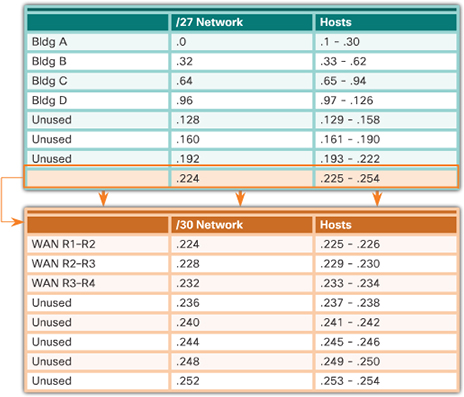
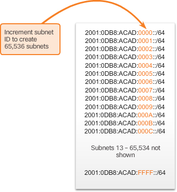

A router forwards packets based on the network portion of an IP address.

Introducing an additional level to the hierarchy creates additional sub-groups within an IP network that facilitates faster packet delivery and added filtration, by helping to minimize ‘local’ traffic.

## Subnetting an IPv4 Network

Without subnetting an IPv4-based network, performance would quickly decrease as the number of hosts increased

A large broadcast domain is a network that connects many hosts. 

### Subnetting an IPv4 Network 

**Every interface on a router is connected to a network.** 
The IPv4 address and subnet mask configured on the router interface are used to identify the specific broadcast domain. 

important addresses of the first subnet, 192.168.1.0/25.

Router interfaces must be assigned an IP address within the **valid host range** for the assigned subnet. This is the address that hosts on that network will use as their **default gateway**. A very common practice is to use the first or last available address in a network range for the router interface address.

### Subnetting to meet requirements

The topology for the branch locations, shown in Figure, consists of 5 LAN segments and 4 internetwork connections between routers. Therefore, **9** subnets are required. The largest subnet requires 40 hosts.

every two routers form a subnet

### Variable length subnet masking

With VLSM, the network is first subnetted, and then the subnets are subnetted again. This process can be repeated multiple times to create subnets of various sizes.

Designing the addressing scheme in this way leaves 3 unused, contiguous /27 subnets and 5 unused, contiguous /30 subnets.

## Addressing Scheme

Performing a network requirement study is the starting point. This means looking at the entire network and determining the main sections of the network and how they will be segmented. The address plan includes determining the needs of each subnet in terms of size, how many hosts per subnet, how host addresses will be assigned, which hosts will require static IPv4 addresses, and which hosts can use DHCP for obtaining their addressing information.

## Subnetting an IPv6 Network

The same reasons for subnetting IPv4 address space in order to manage network traffic also apply to IPv6. 

- Global Routing Prefix – This is the prefix, or network, portion of the address that is assigned by the provider. Typically, Regional Internet Registries (RIRs) assign a /48 global routing prefix to ISPs and customers.
- Subnet ID – Used by an organization to identify subnets within its site.
- Interface ID – This is the equivalent to the host portion of an IPv4 address. The term interface ID is used because a single host may have multiple interfaces, each having one or more IPv6 addresses. It is recommended that a 64-bit interface ID should be used in most networks.

## Check Your Understanding Questions

1. What are advantages of subnetting a large network? (Choose two.)
(B, D)

A. More address space is created.

B. Overall network traffic is reduced.

C. IP addresses can be reused on the same subnetwork.

D. Network performance is improved.

E. Layer 3 devices are not required when a network is subnetted.

2. What device would permit hosts on different subnets to be able to communicate?
(C)

A. Hub

B. Layer 2 switch

C. Router

3. Fill in the blank. To create subnets, bits are borrowed from the (host) portion of an IP address.

4. How many subnets can be created if 4 bits are borrowed to specify subnets?
(D)

A. 4

B. 8

C. 14

D. 16

5. What best describes a network broadcast address?
(D)

A. All 0 bits in the host portion of the address

B. All 0 bits plus a rightmost 1 bit in the host portion of the address

C. All 1 bits plus a rightmost 0 bit in the host portion of the address

D. All 1 bits in the host portion of the address

6. How many valid host addresses are created when 4 host bits are borrowed from the 10.20.20.0/24 network?
(C)

A. 2

B. 4

C. 14

D. 16

E. 126

F. 128

G. 254

H. 256

7. A junior network technician has subnetted the 10.20.30.0/24 address space by borrowing 3 bits. The technician decides to use the second subnet for the Accounting department computers. Which of the following addresses could the network technician assign to hosts? (Choose three.)
10.20.30.33/27 -- 10.20.30.63/27
(D, E, F)

A. 10.20.30.29/27

B. 10.20.30.31/27

C. 10.20.30.32/27

D. 10.20.30.33/27

E. 10.20.30.34/27

F. 10.20.30.35/27

8. A junior network technician is assigning host addresses to devices in the 192.168.1.0/25 subnet. The departmental printer is assigned the address 192.168.1.131/25 with a 192.168.1.1/25 default gateway. No one in the department is able to print. What is the cause of the problem?
max valid host addr is 192.168.1.126/25
(C)

A. The default gateway is not correct for the departmental subnet.

B. The printer has been assigned a broadcast IP address.

C. The printer has been assigned an address on another subnet.

D. The printer has been assigned a network IP address.

9. A new department has been established with 511 hosts that require addresses. Currently the company uses the 10.20.0.0/16 address space. How many bits must the network administrator borrow to provide addresses for this subnet without wasting addresses?
511 needs 10 bits on host portion, so 6 bits could be borrowed
(B)

A. 5

B. 6

C. 7

D. 8

E. 9

10. A network technician borrows 5 bits from the 10.0.0.0/16 network to create subnets. What is the subnet mask that should be associated with each of the newly created subnets?
(C)

A. 255.248.0.0

B. 255.255.0.0

C. 255.255.248.0

D. 255.255.255.0

E. 255.255.255.248

11. Fill in the blank. (VLSM) provides a more efficient IP address allocation by allowing the use of different-size subnets in the same network.

12. A network administrator has borrowed 3 bits from the 10.20.0.0/25 network to create subnets. The administrator then decided to use the first subnet for point-to-point serial WAN connections each requiring two addresses. How many WAN connections can the administrator address using only the first subnet if he is using VLSM?
the first subnet is 10.20.0.0/28, how many subnets it could be further divided into, each sub-subnet should have at least 2 valid host addr
(C)

A. 1

B. 2

C. 4

D. 16

E. 32

F. 64

G. 128

13. A network administrator has decided to use VLSM to subnet the 10.11.0.0/20 network to provide addresses for two new departments and the point-to-point link that separates the two departments. The first department has 796 users and the second department has 31 users. The WAN link requires only two addresses. Which of the following subnets will provide the required contiguous space and waste the fewest addresses? (Choose three.)
num of hosts required -> mask length
(B, D, F)

A. 10.11.0.0/21

B. 10.11.0.0/22

C. 10.11.253.0/25

D. 10.11.253.0/26

E. 10.11.253.128/29

F. 10.11.253.64/30

14. What is the primary purpose of subnetting an IPv6 address space? (Choose two.)
(B, C)

A. Conservation of addresses

B. Support hierarchical network design

C. Manage network traffic

D. Support a classful addressing system

E. Simplify DHCP address assignment

15. What is the most common process to subnet an IPv6 network?
(A)

A. Use the range of hexadecimal values in the subnet ID

B. Borrow from the interface ID

C. Borrow from the host portion