## Objectives

- What is the purpose of the transport layer in managing the transportation of data in end-to-end communications?

- What are the characteristics of TCP and UDP?

- What is a port number and what is it used for?

- How do the TCP session establishment and termination processes facilitate reliable communication?

- How are TCP protocol data units transmitted and acknowledged to guarantee delivery?

- How does UDP establish communications with a server?

- What factors determine whether high reliability TCP transmissions, or nonguaranteed UDP transmissions, are best suited for common applications?

### Role of the Transport Layer 

The transport layer is responsible for establishing a temporary communication session between two applications and delivering data between them. 

- Tracking Individual Conversations

each set of data flowing between a source application and a destination application is known as a conversation

- Segmenting Data and Reassembling Segments

- Identifying the Applications

To pass data streams to the proper applications, the transport layer must identify the target application (Figure 9-4). To accomplish this, the transport layer assigns each application an identifier called a port number. 

### Conversation Multiplexing

multiplexing divides the data into smaller segments and enables communications from many different users to be interleaved (multiplexed) on the same network.

### Transport Layer Reliability

IP is concerned only with the **structure**(?), addressing, and routing of packets. IP does not specify how the delivery or transportation of the packets takes place. Transport protocols specify how to transfer messages between hosts.

### TCP

three basic operations of reliability:

- Numbering and tracking data segments transmitted to a specific host from a specific application

- Acknowledging received data

- Retransmitting any unacknowledged data after a certain period of time

establishes a virtual connection (or session) between source and destination devices prior to forwarding any traffic

By numbering and sequencing the segments, TCP can ensure that these segments are reassembled into the proper order.

it can request that the sending application reduce the rate of data flow. 

TCP is a stateful protocol. A stateful protocol is a protocol that keeps track of the state of the communication session. To track the state of a session, TCP records which information it has sent and which information has been acknowledged.

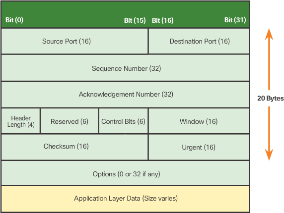

### UDP

UDP is known as a best-effort delivery protocol. 

In the context of networking, best-effort delivery is referred to as unreliable 

With UDP, there are no transport layer processes that inform the sender of a successful delivery.

offers the same data segmentation and reassembly as TCP

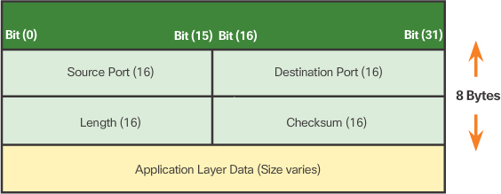

### Port Number

Source Port

The source port number is dynamically generated by the sending device to identify a **conversation** between two devices. 

send multiple HTTP service requests to a web server at the same time. 
Each separate HTTP conversation is tracked based on the source ports.

The combination of the source IP address and source port number, or the destination IP address and destination port number is known as a **socket**. 

A client socket might look like this, with 1099 representing the source port number: **192.168.1.5:1099**

(发第一个 segment 怎么知道 destination port number?)

The source port number acts as a **return address** for the requesting application. The transport layer keeps track of this port and the application that initiated the request so that when a response is returned, it can be forwarded to the correct application.

其实只有 public destination port 才能被直接 call 到

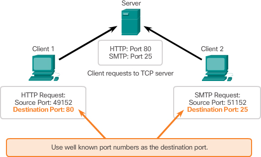

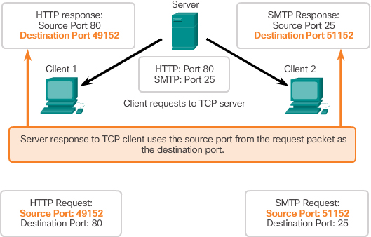

- Well-known Ports (Numbers 0 to 1023)

- Registered Ports (Numbers 1024 to 49151) – For example, Cisco has registered port 1985 for its Hot Standby Routing Protocol (HSRP) process.

- Dynamic or Private Ports (Numbers 49152 to 65535)

### TCP Connection Establishment 

In TCP connections, the host client establishes the connection with the server.

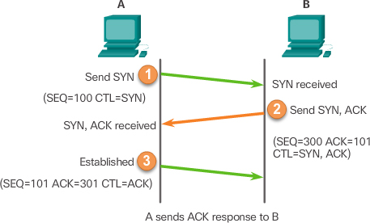

### TCP Session Termination

To end each one-way TCP session, 
a two-way handshake (FIN segment + an Acknowledgement (ACK) segment) is used.

termination process can be initiated by any two hosts

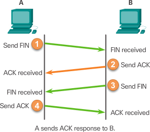

### Control Bits

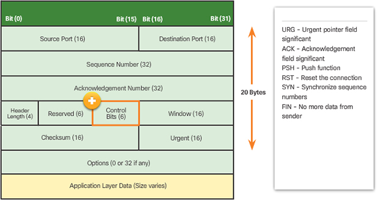

### TCP Reliability – Ordered Delivery

Sequence numbers are assigned in the header of each packet to achieve this goal. The sequence number represents the first data byte of the TCP segment.

During session setup, an initial sequence number (ISN) is set. 
This ISN represents **the starting value of the bytes** for this session that is transmitted to the receiving application. 
As data is transmitted during the session, the sequence number is **incremented by the number of bytes** that have been transmitted. 
This data byte tracking enables each segment to be uniquely identified and acknowledged. Missing segments can then be identified.

The ISN does not begin at one but is effectively a random number. This is to prevent certain types of malicious attacks.

The receiving TCP process places the data from a segment into a **receiving buffer**. Segments are placed in the proper sequence order and passed to the application layer when reassembled. Any segments that arrive with sequence numbers that are out of order are held for later processing. Then, when the segments with the missing bytes arrive, these segments are processed in order.

The SEQ number identifies **the first byte of data in the segment being transmitted**. 
TCP uses the ACK number sent back to the source to indicate **the next byte that the receiver expects to receive**. 
This is called expectational acknowledgement.

e.g.
For example, the receiving host receives the segment at Layer 4 and determines that the sequence number is 1 and that it has 10 bytes of data. The host then sends a segment back to the host on the left to acknowledge the receipt of this data. In this segment, the host sets the ACK number to 11 to indicate that the next byte of data it expects to receive in this session is byte number 11. When the sending host receives this acknowledgement, it can now send the next segment containing data for this session starting with byte number 11.

Hosts today typically employ an optional feature called selective acknowledgements (SACK). If both hosts support SACKs, it is possible for the destination to acknowledge bytes in discontinuous segments and the host would only need to retransmit the missing data.

### TCP Flow Control – Window Size and Acknowledgements

TCP also provides mechanisms for flow control, the amount of data that the destination can receive and process reliably. 

Flow control helps maintain the reliability of TCP transmission by adjusting the rate of data flow between source and destination for a given session. 

To accomplish this, the TCP header includes a 16-bit field called the window size.

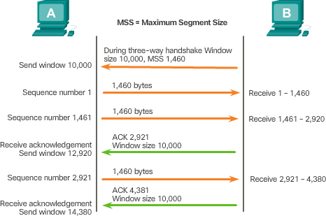

 In this example, PC B’s initial window size for the TCP session is 10,000 bytes. 
 
 **Starting with the first byte, byte number 1, the last byte PC A can send without receiving an acknowledgement is byte 10,000.** 
 
 This is known as PC A’s **send window**. The window size is included in every TCP segment, so the destination can modify the window size at any time depending on buffer availability.

The process of the destination sending acknowledgements as it processes bytes received and the continual adjustment of the source’s send window is known as **sliding windows**.

The receiver typically sends an acknowledgement after **every two** segments it receives. The number of segments received before being acknowledged may vary. The advantage of sliding windows is that it allows the sender to continuously transmit segments as long as the receiver is acknowledging previous segments. The details of sliding windows are beyond the scope of this course.

If the availability of the destination’s buffer space decreases, it may reduce its window size to inform the source to reduce the number of bytes it should send without receiving an acknowledgement.

### TCP Flow Control – Congestion Avoidance

By determining the rate at which TCP segments are sent but not acknowledged, the source can assume a certain level of network congestion.

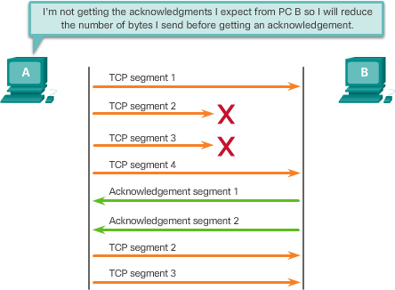

### UDP Datagram Reassembly

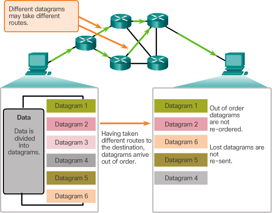

Therefore, UDP simply reassembles the data in the order that it was received and forwards it to the application. If the data sequence is important to the application, the application must identify the proper sequence and determine how the data should be processed.

### UDP Server Processes and Requests

Like TCP-based applications, UDP-based server applications are assigned well-known or registered port numbers, as shown in Figure 9-34. When these applications or processes are running on a server, they accept the data matched with the assigned port number. When UDP receives a datagram destined for one of these ports, it forwards the application data to the appropriate application based on its port number.

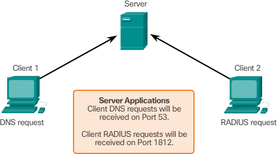

### Applications that Use TCP or UDP

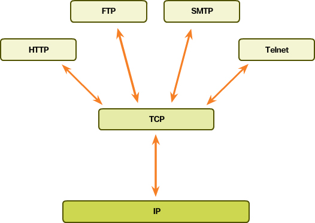

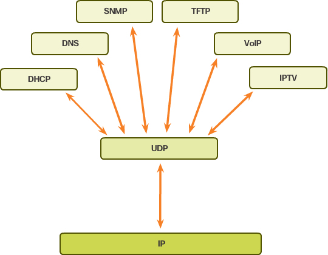

UDP **datagrams** and TCP **segments**

## Check Your Understanding Questions

1. What are the primary purposes of the transport layer? (Choose three.) 
(C, E, F)

A. Determining the best route between source and destination

B. Adding the source and destination MAC address to frames

C. Tracking the individual communication between applications on the source and destination hosts

D. Adding the source and destination IP address

E. Segmenting data for and reassembling segmented data into streams of application data at the destination

F. Identifying the proper application for each communication stream

2. What is assigned by the transport layer to identify an application or service?
(C)

A. Segment

B. Packet

C. Port

D. MAC address

E. IP address

3. Fill in the blank. _____ is the term used to describe the interleaving of data from multiple users on the same network.
(multiplexing)

4. What is a characteristic of UDP?
(B)

A. Reliable delivery

B. Connectionless

C. Windowing

D. Expectational acknowledgements

E. Flow control

5. Which of the following types of applications would use UDP? (Choose three.)
(B, E, **F**)

A. Telnet

B. VoIP

C. FTP

D. HTTP

E. DHCP

F. TFTP

6. Which TCP header field specifies the number of bytes that can be accepted before an acknowledgement is required?
(C)

A. Acknowledgement number

B. Header length

C. Window size

D. Checksum

7. Fill in the blank. Both TCP and UDP use ____ to separate multiple communications on the same channel.
(port numbers)

8. What is an advantage that UDP has over TCP?
(B)

A. Advanced flow control

B. Low overhead

C. Reordering of segments

D. Reliable delivery

9. What range of ports can either be used by TCP or UDP to identify the requested service on the destination device or as a client source port?
(C)

A. 0 to 1023

B. 0 to 49151

C. 1024 to 49151

D. 49152 to 65535

10. Fill in the blank. A dynamic port in the range of 49152 to 65535 is also known as a(n) ____ port.
(ephemeral)

11. What does UDP do when receiving messages that are more than one datagram in length?
(B)

A. UDP places the datagrams into the correct order before passing them to the application.

B. UDP reassembles that data in the order it was received and passes it to the application.

C. UDP requests retransmission of the datagrams in the correct order before passing to the application.

D. UDP transmissions are limited to a single datagram.

12. Which TCP header control bit is set on to terminate a TCP conversation?
(F)

A. URG

B. ACK

D. PSH

D. RST

E. SYN

F. FIN

13. If a client sends an ISN of 2 to a server and a server responds with an ISN of 1 to the client, what is the final stage of the TCP three-way handshake?
(A)

A. Client sends an acknowledgement of 2.

B. Server sends an acknowledgement of 2.

C. Client sends an acknowledgement of 3.

D. Server sends an acknowledgement of 3.

E. Client sends a new ISN of 3.

F. Server sends a new ISN of 2.

14. A client is downloading a large file from a server using FTP. Many of the segments are lost during transit. What will most likely happen?
(G -> **B**)

A. The FTP session is immediately terminated.

B. The FTP client responds to the server with a smaller window size in the TCP header.

C. The FTP client responds to the client with an increased window size in the TCP header.

D. The FTP server responds to the client with a smaller window size in the TCP header.

E. The FTP server responds to the client with an increased window size in the TCP header.

F. The FTP session continues, but the result is a corrupt file that must be downloaded again.

G. The FTP session continues with no alteration in window size, and the missing segment is requested again after the rest of the file is downloaded.

15. Fill in the blank. TCP will normally retransmit lost data from the last successful acknowledgement. To allow the destination to acknowledge bytes in discontinuous segments and request retransmission of only the missing data, both hosts must be able to support an optional feature called __________.
(selective acknowledgement)

================================

Websocket implemented with UDP?
(no, it is implemented over a single TCP connection)

Would TCP keep track of a full route path?
(TCP does not keep track of the full route path that data takes between the source and destination hosts. Instead, it relies on the underlying network layer protocols (such as IP) to handle the routing of packets between hosts. )

How are control bits used in TCP header?

The TCP header contains several control bits that are used to manage the communication between two hosts. Here's a brief description of each control bit:

1. URG (Urgent): When this bit is set, the data should be treated as priority over other data.

2. ACK (Acknowledgment): This bit is set when the Acknowledgment Number field in the TCP header is valid.

3. PSH (Push): This bit is set when the sender wants to push data to the receiver without waiting for a full buffer. It indicates that the receiver should deliver the data to the application as soon as possible. we don’t want to wait to fill the entire TCP segment.

4. RST (Reset): When you receive this you have to terminate the connection right away. This is only used when there are unrecoverable errors.

5. SYN (Synchronize): We use this for the initial three way handshake and it’s used to set the initial sequence number.

6. FIN (Finish): This finish bit is used to end the TCP connection. TCP is full duplex so both parties will have to use the FIN bit to end the connection. This is the normal method how we end an connection.

These control bits are used in various combinations to manage the TCP connection between two hosts.
