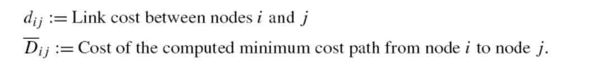
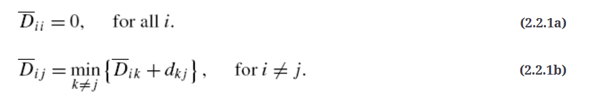
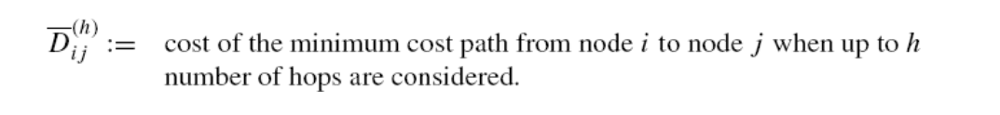
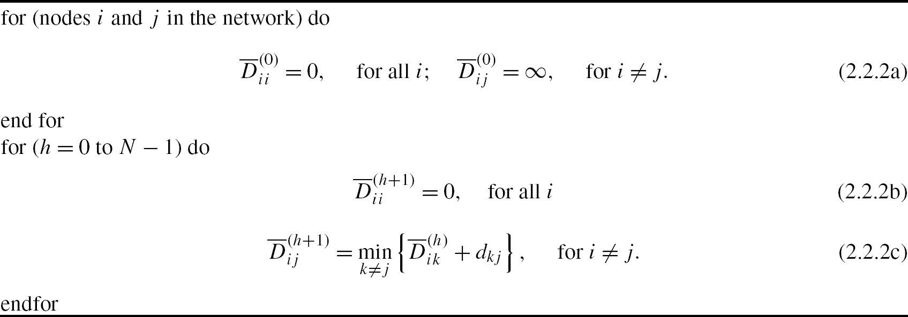
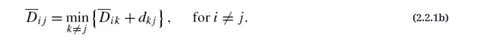
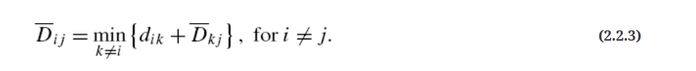
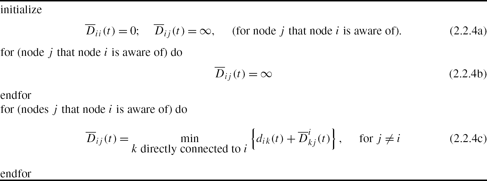

# Bellman–Ford Algorithm and the Distance Vector Approach

## Centralized View: Bellman–Ford Algorithm

The following equations, known as Bellman's equations

###  Bellman–Ford centralized algorithm

## Distributed View: A Distance Vector Approach

This view of the centralized Bellman–Ford algorithm is not directly suitable for a distributed environment
centralized 方式中 i 知道所有信息，以 i 为中心，慢慢发现

 change the order of consideration for **distributed environment**

### Distance vector algorithm (computed at node i)
