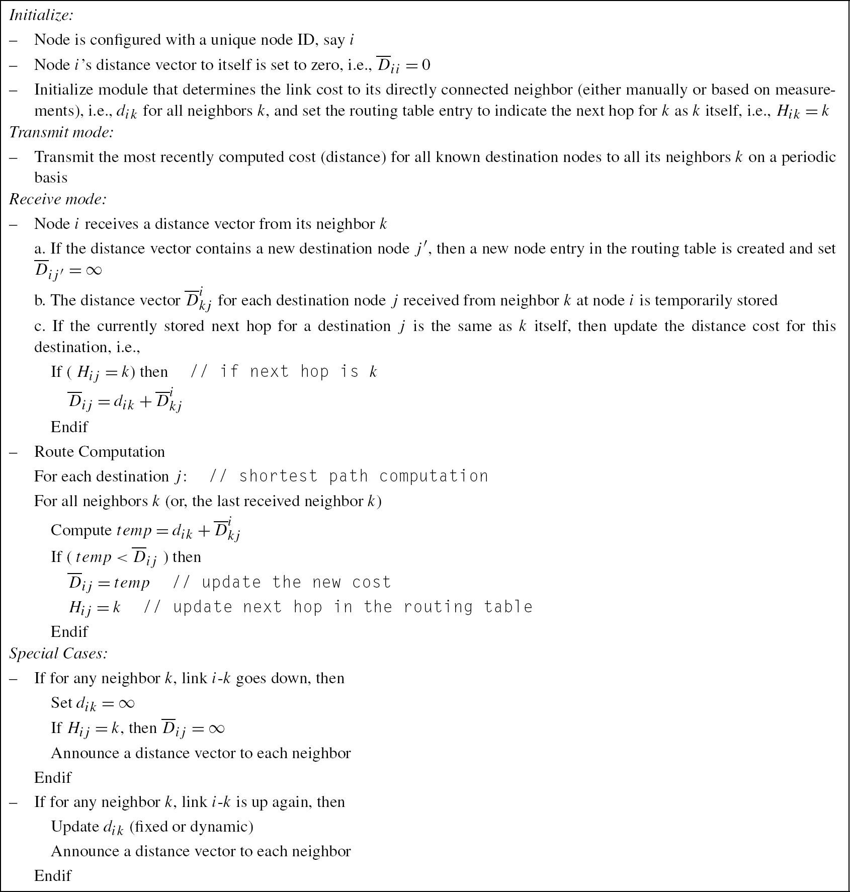
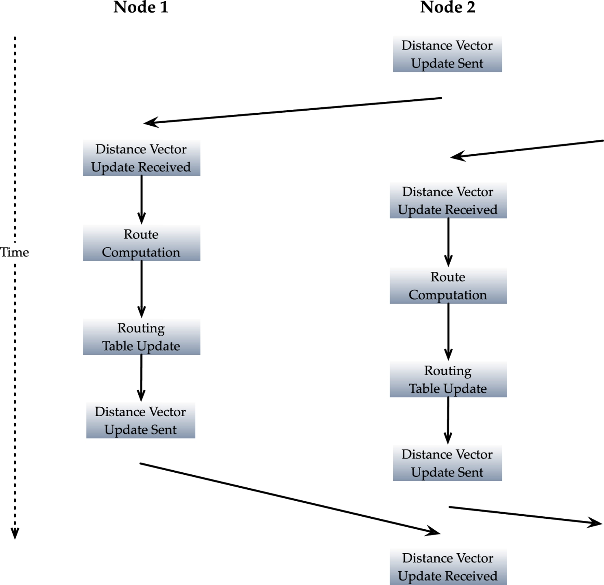
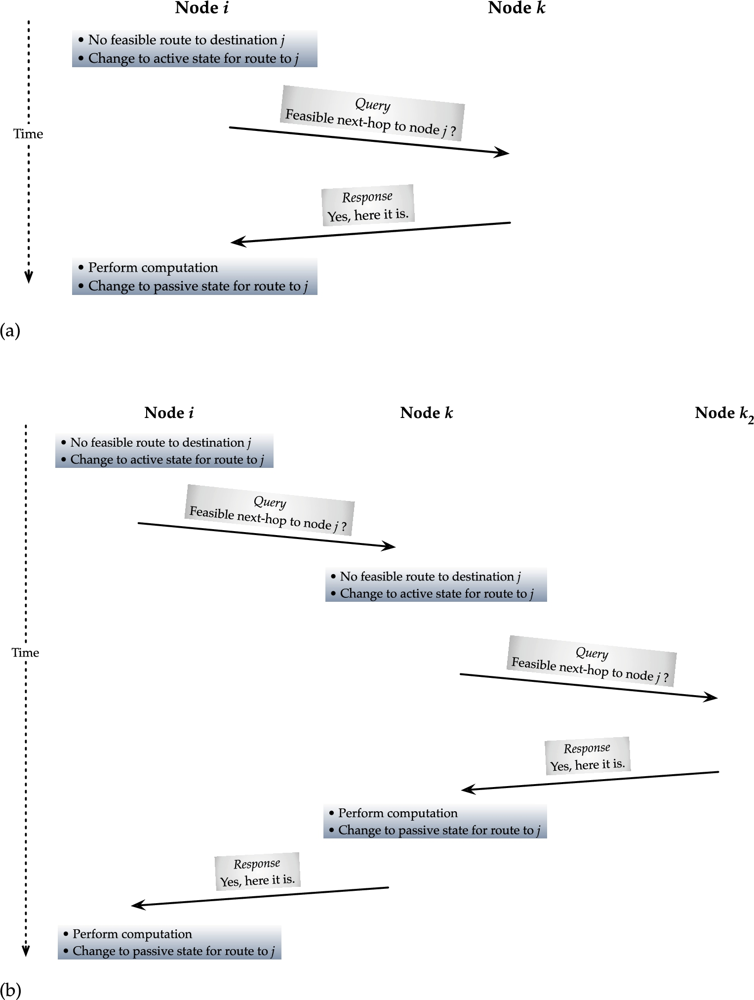
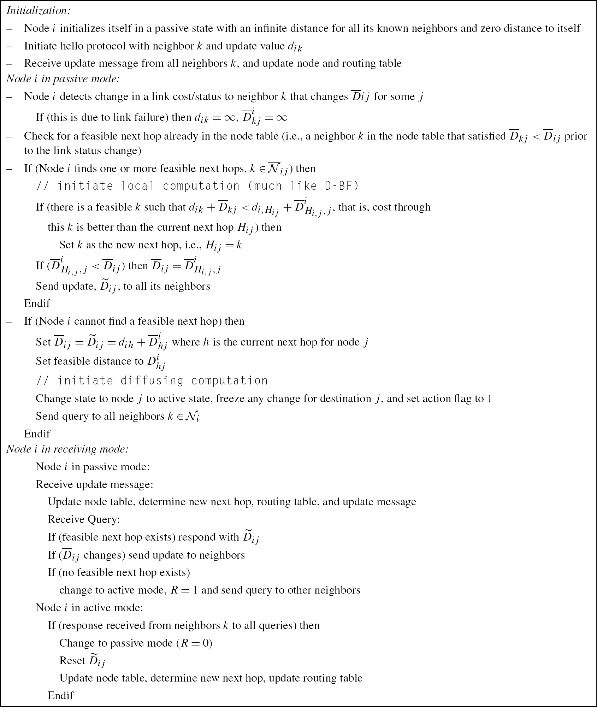
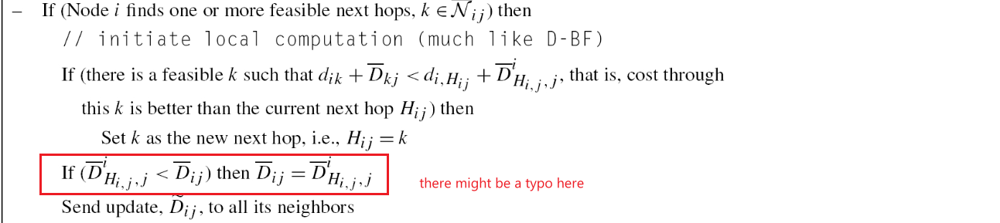
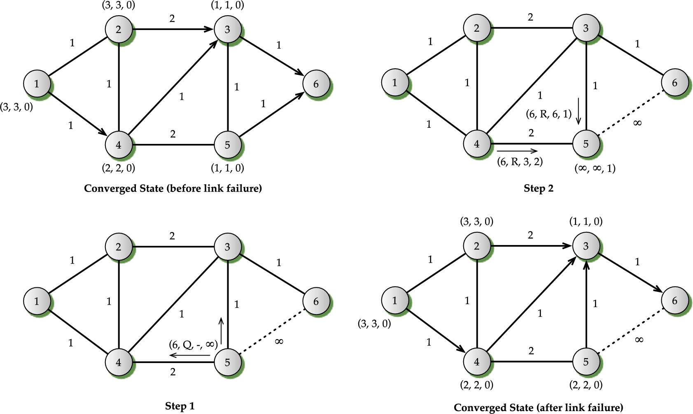
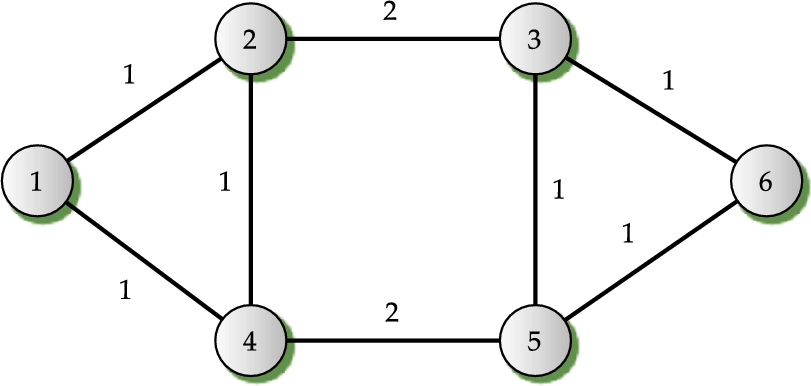
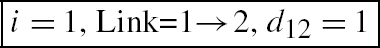
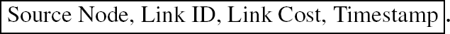
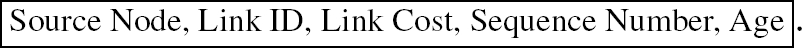

# Table of Content

[Overview](#overview)

[Distance Vector](#distance-vector-routing-protocol)

[Basic Distance Vector](#basic-distance-verctor)

[Looping](#looping)

[Loop-free Distance Vector](#loop-free-distance-vector)

[Basic Vs Loop-free](#basic-vs-loop-free)

[Link State Routing Protocol](#link-state-routing-protocol)

[Link State: In-Band Hop-by-Hop](#link-state-protocol-in-band-hop-by-hop-dissemination)

[Link State Advertisement and Flooding](#link-state-advertisement-and-flooding)

# Overview

Routing protocols are mechansims by which routing information is exchanged between routers so that routing decisions can be made

A major role of a routing protocol is to facilitate this exchange of information in a standardized manner, sometimes also coupled with routing computations.
distance vector, link state, and path vector

in-band, in our context, means that the communication network that carries user traffic also carries a routing information exchange
Out-of-band, as we use here, means that a completely separate network or mechanism is used for exchanging routing information

A routing table at a node provides a lookup entry for each destination by identifying an outgoing link/interface or a path

# Distance Vector Routing Protocol

### Basic distance verctor

(describe it out loud then you will understand)

- 来自 k 的 message 是什么: 是 k 到**所有** j 的距离
- 这个 message 会影响我什么: 
  - 如果我(i) 到达某个 j 的路径直接经过 k, 那么直接更新
  - 如果我(i) 到达某个 j 的路径原先不经过 k, 现在经过 k 能更短的话，那么更新

timeline of activities between two nodes

routing environment encounters a transient period during which different nodes may have different views of the network; this is the **root cause** of many undesirable problems

convergence refers to the same view arrived at by all nodes in a network from an inconsistent view

A major problem with a distance vector protocol is that it can cause routing loops

In this situation, user traffic will go in a circular manner 
e.g
node 2, node 3 both have path to node 6, and 3-6 directly connected
then 3-6 failed, node 3 update destination(6) to be super big, **but node 3 failed to update to node 2**
while later node 2 update to node 3 with some old data related to node 6 (**update with old data distribute later and is treated as newer data**)
then node 3 update destination(6) with old data
as a reult, node 2 route to node 3 for destination 6, node 3 also route to node 2 for destination 6

The basic idea of split horizon is quite simple: when transmitting a distance vector update on an outgoing link, send updates only for nodes for which this link is not on its routing table as the outgoing link. **solve the count to infinity problem in some instances**.

split horizon with poisoned reverse, where news about all nodes is provided; in this case, the ones accessible on the outgoing link are marked as ∞. 
Note that this **does not help solve the looping problem**; it simply helps to identify a possible loop and to stop doing a mistaken shortest path computation and from forwarding the user traffic

the following are good steps to take in a distance vector protocol:

•  Once the shortest path is computed by a node, it immediately updates the routing table—there is no reason to inject a time gap.

•  When an outgoing link is found to be down, the routing table is immediately updated with an infinite cost for the destinations that would have used this link as the outgoing link, and a distance vector is generated to other outgoing links to communicate explicitly about nodes that are not reachable.

•  As part of normal operations, it is a good idea to periodically send a distance vector to its neighbors, even if the cost has not changed. This helps the neighbor to recognize/realize that its neighbor is not down.

•  If a routing environment uses an unreliable delivery mechanism for dissemination of the distance vector information, then, besides the periodic update timer (“Keep-alive” timer), an additional timer called a Holddown Timer is also used. **Typically, the hold timer has a value several times the value of the periodic update timer**. This way, even if a periodic update is sent and a neighboring node does not hear it, for example, due to packet corruption or packet loss, the node would not immediately assume that the node is unreachable; it would instead wait till the holddown timer expires before updating the routing table (for more discussion, see Section 5.3 about Routing Information Protocol (RIP)—a protocol that uses an unreliable delivery mechanism for routing information).

•  If a routing environment uses a reliable delivery mechanism for dissemination of the distance vector information, the holddown timer does not appear to be necessary (in addition to the periodic update timer). However, the holddown timer still plays a critical role, for example, when a node's CPU is busy and cannot generate the periodic update messages within its timer window. Instead of assuming that it did not receive the periodic update because its neighbor is down, it can wait until the holddown timer expires. Thus, for such situations, the holddown timer helps to avoid unnecessary destabilization.

•  The count to infinity situation was aggravated partly because one of the critical links had a much higher cost then the other links. Thus, in a routing environment running a distance vector protocol, it is often recommended that link costs be of comparable value and certainly should not be different in orders of magnitude.

•  From the illustrations, it is clear that while the periodic update is a good idea, certain updates should be communicated as soon as possible; for example, when a node is activated, when a link goes down, or when a link comes up. In general, if the cost of a link changes significantly, it is a good idea to generate a distance vector update immediately, often referred to as the **triggered update**. This would then lead to a faster convergence; furthermore, the count to infinity problem can be minimized (although it cannot be completely ruled out).

•  If the cost on a link changes and then it changes back again very quickly, this would result in two triggered updates that can lead to other nodes updating their routing tables and then reverting back to the old tables. This type of oscillatory behavior is not desirable. Thus, to avoid such frequent oscillations, it is often recommended that there be a **minimum time interval** (holddown timer) between two consecutive updates. This certainly stops it from updating new information as quickly as possible and dampens convergence; but, at the same time, this also helps in stopping the spread of bad information too quickly.

•  There is another possible effect with a distance vector protocol. Nodes are set up to send distance vector updates on a periodic basis, as mentioned earlier. Now, consider a node that is directly connected to 10 other nodes. Then, this node will be sending a distance vector on 10 outgoing links and at the same time it will be receiving from all of them. This situation can lead to congestion at the node including CPU overload. Thus, it is preferable that periodic updates from different nodes in a network are asynchronous. To **avoid synchronous operations**, instead of updating on the expiration of an exact update time, a node computes the update time as a random amount around a mean value. For example, suppose that the average update time is 1 min; thus, an update time can be chosen randomly from a uniform distribution with 1 min as the average ± 10 sec. This way, the likelihood of advertising at the same time by different routers can be reduced.

it is also important to recognize that while a routing protocol needs a variety of timers, the actual value of the timers should not be rigidly defined as a part of the protocol description.
we have learned enough to know that it is important to leave the rigid values out of the protocol; 
instead, include the threshold values and range, and let the operational environment determine what are the best values to use in practice. 

### Looping

we could say that looping is the most serious problem since user packets will bounce back and forth between two (or more) nodes.

 the **source of looping**.
 On close scrutiny, you will note that the looping is induced by the Bellman–Ford computation in a distributed environment and it occurs when a link fails. In fact, looping can occur when the link cost also increases; incidentally, link failure can be thought of as a special case of increases in link cost (when link cost is set to ∞). You might wonder, what about a link cost decrease? This case is actually not a problem since Bellman–Ford can be applied as before.
 
 在 distributed 方式中，对于 node i, 只有 d_ik 是自己确信的，其他信息都来自别人，
 如果别人的信息是错误的，node i 的 routing table 就不会准确，
 如果有一些 neighbor 对于环境变化 learn 比较晚，就会告诉 node i 一些错误的信息，
 此时如果按照 根据错误 cost 计算出来的 path 去做 routing, 就会陷入一个 loop，
 我以为这条路可以通，但其实已经不通了，
 我以为这条路可以通，是因为你告诉我可以通，但其实已经不通了，
 routing table 还在更新，但是此时这些数值已经不能反映事实了，所以真正去 routing 的话就会进入 loop

if the distance vector announcement contains certain additional information beyond just the distance, and additionally, route computation is performed through inter-nodal coordination between a node and its neighbors, then looping can possibly be avoided.

 ### Loop-free distance vector

 It is important to note that in a loop-free distance vector protocol, distance vector updates are not periodic and also need not contain the distance for all destinations

 In the case of the loop-free distance vector protocol, route computation is a bit different depending on the situation; furthermore, there are three additional aspects that need to be addressed: building the neighbor table, node discovery and creating entry in the network node table, and coordination activity when the link cost changes or the link fails. 

It is important to note that in a loop-free distance vector protocol, distance vector updates are not periodic and also need not contain the distance for all destinations; furthermore, through the message type, it can be indicated whether a message is an update message or otherwise.

a node is required to maintain two states: passive (0) and active (1).

When it is passive, it can receive or send normal distance vector updates.

When it is in an active state, node table entries are frozen. Note that when it is in an active state, a node generates the request message instead of the update message and keeps track of which requests are outstanding; it moves to the passive state when responses to all outstanding requests are received.

 

Loop-free distance vector protocol based on diffusing computation with coordinated update
 

### Basic Vs Loop-free

difference:
- distance ij: only option -> a feasible set
- update message: all(might include old ones) -> latest updated ones
- if distance missing(or unavailable): leave it -> active solicit from neighbors 

To summarize, it is possible to use a distance vector protocol framework and extend it for loop-free routing by using diffusing computations with coordinated updates. Like any protocols, it has limitations under certain conditions.

因为 node 5 在 5-6 went down 时会主动询问它的所有邻点
所以如果有一个 loop 的话，一定会被这种询问打破

# Link State Routing Protocol

has its roots in Dijkstra's shortest path first algorithm.
it requires a node to have topological information to compute the shortest paths.
record whether this link is up or down—generally referred to as the state of the link. This then gives rise to the name **link state**.

DCR: dynamically controlled routing

RTNR: real-time network routing

out-of-band:
- any pair of nodes can talk to each other through this mechanism irrespective of their location
- all nodes communicate to a central system through a dedicated channel, which then communicates back to all nodes. 

in-band:
- on a hop-by-hop basis
- on a connection/session basis.

The rest of the discussion in this section mostly centers around the exchange of routing information using in-band communication on a hop-by-hop basis. At the end of this section, we will also discuss in-band communication on a session basis.

## Link State Protocol: In-Band Hop-by-Hop Dissemination

### Link State Advertisement and Flooding

A link state message, often referred to as a link state advertisement (LSA), 
is generated by a node for **each of its outgoing links**, 
and each LSA needs to contain at least

 we have learned one important thing: reliable delivery of routing information is important. 
 
 You will find out that almost all routing protocols, since the early days of the basic distance vector protocol, use reliable delivery of routing information. Henceforth, we will assume reliable flooding with the link state protocol.

 

 the link that connects from node 1 to node 2 in Figure 3.11: this LSA will be generated by node 1; 
 however, in the reverse direction, LSA for the same link from node 2 to node 1 will be generated by node 2.

 this message is forwarded to both nodes 2 and 4.

If the cost value of both the LSAs for the same link is the same, then it is not difficult to resolve. However, if the value is different, then a receiving node needs to worry about which LSA for a particular link was generated more recently.

 

 There are two possibilities: 
 - either all nodes are clock-synchronized through some geosynchronous timing system, 
 - or a clock-independent mechanism is used. 

 Most link state routing protocols use a clock-independent mechanism called the sequence number to indicate the notion of a time stamp

 

 It is important that each node maintains a different sequence number counter for each outgoing link, 
 and that other nodes maintain their own sequence number counters for their outgoing links

the concept of a source-initiated, link-based sequence number. 

a key issue to consider: the size of the sequence number space.
When a node receives two LSAs for the same link-id from two different neighbors, one with sequence number 7 and the other with sequence number 2, the receiving node has no way of knowing if the sequence number 2 is after the number is wrapped or before.
This tells us that the size of the sequence number space should not be small

However, there is still some ambiguity, for example, when a node goes down and then comes back up with the sequence number set to onej

Essentially, what this means is that some additional safeguard is required to ensure that a receiving node is not confused. A possible way to provide this safeguard is to use an additional field in LSA that tells the age of the LSA. Taking this information into account, the LSA takes the form:

in many protocol implementations, the sequence number space is considered as a lollypop sequence number space; 

consider a 32-bit signed sequence number space. The sequence number is varied from the negative number to the positive number while the ends are not used. 

The sequence number begins in the negative space and continues to increment; once it reaches the positive space, it continues to the maximum value, but cycles back to 0 instead of going back to negative; that is, it is linear in the negative space and circular in the positive space giving the shape of a lollypop and thus the name.

R1 announces the sequence number Image to its neighbor R2. The neighbor R2 immediately knows that R1 must have restarted and sends a message to R1 announcing where R1 left off as the last sequence number before the failure. On hearing this sequence number, R1 now increments the counter and starts from the next sequence number in the next link state advertisement.

