[Single-Commodity Network Flow](#single-commodity-network-flow)

[Minimum Cost Routing Objective](#minimum-cost-routing-objective)

[Load Balancing](#load-balancing)

[Average Delay](#average-delay)

Routing Efficiency -> Traffic Engineering

traffic volume - traffic network - IP/telephone network - traffic routing
demand volume - transport network - DS3-cross-connect, SONET, WDM network where circuits are deployed - transport routing/ circuit routing/ demand routing

In this chapter, we will uniformly use the term demand volume, 
without attaching a particular measurement unit or a network type
since our goal here is to present the basic concepts of network flow models.

 Any amount of demand volume that uses or is carried on a path is referred to as **flow**; 
 this is also referred to as **path flow**, 
 or **flowing demand volume** on a path, 
 or even **routing demand volume** on a path. 

## Single-Commodity Network Flow

three node network
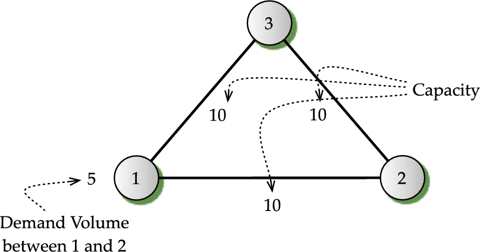

actual routing decision should depend on the goal of routing, irrespective of the hop count. 
This means that we need a generic way to represent the problem so that various situations can be addressed in a capacitated network in order to find the best solution.

capacity: c
demand volume: h
demand volume on path 1-2: x12
demand volume on path 1-3-2: x132

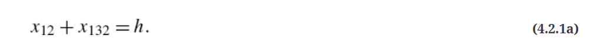

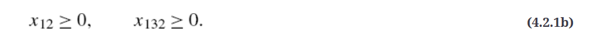

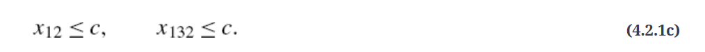

(4.2.1a), (4.2.1b), and (4.2.1c) is referred to as constraints of the problem

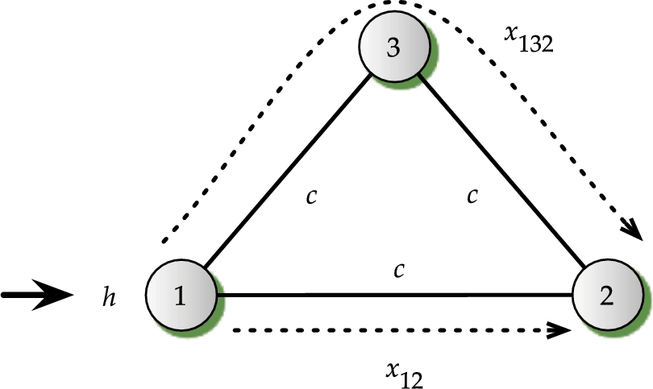

### Minimum Cost Routing Objective

non-negative cost per unit of flow on each path

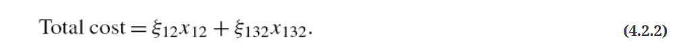

The total cost is referred to as the objective function. In general, the objective function will be denoted by F. If the goal is to minimize the total cost of routing, we can write the complete problem as follows:

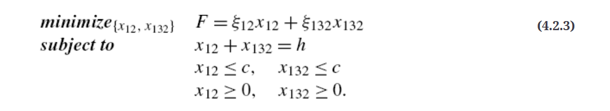

The problem presented in Eq. (4.2.3) is a **single-commodity network flow** problem; 
it is also referred to as a **linear programming problem** 
since the requirements  are all linear, 
and the goal is also linear.
formulation of an **optimization problem**

For clarity, the optimal solution to a problem such as Eq. (4.2.3) will be denoted with asterisks in the superscript, for example, 
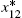 and 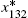.

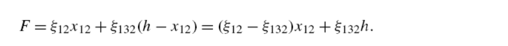

if 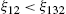, then 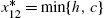; similarly, 

if 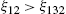, then the minimum is observed when 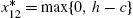.

### Load Balancing

We now consider another goal — minimization of maximum link utilization, 
or the **minimax problem**. 
This goal is also referred to as **load balancing** flows in the network, 
or **congestion minimization** in the network. Perhaps, 
it is best to refer to this objective as the **Wozencraft objective** since he first suggested this objective [880]

The link utilization is defined as the amount of flow on a link divided by the capacity on that link. 

Then, the maximum utilization over all links means the maximum over these two expressions, i.e.

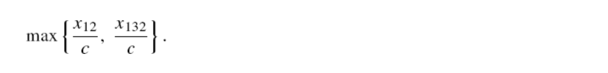

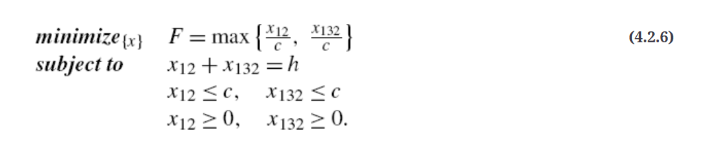

Thus, we see that when the load balancing of flows is the main goal, the optimal solution for Eq. (4.2.6) is to **split the flows equally on both paths**. Certainly, this result holds true as long as the demand volume h is up to and including 2c; the problem becomes infeasible when 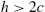.

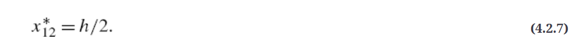

Variation in Capacity

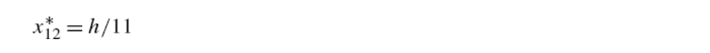

### Average Delay

Another goal commonly defined, especially in data networks, is the minimization of the **average packet delay**. 

For this illustration, we consider again the three-node network with demand volume h between node 1 and node 2; the capacity of all links is set to c. 

The average delay can be captured through the expression
(why?)

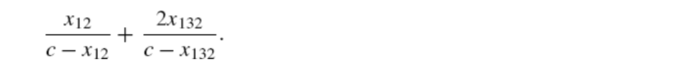

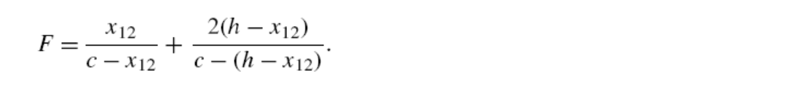

This is a nonlinear function that we want to minimize. We can use calculus to solve this problem. 

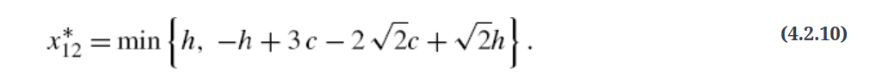