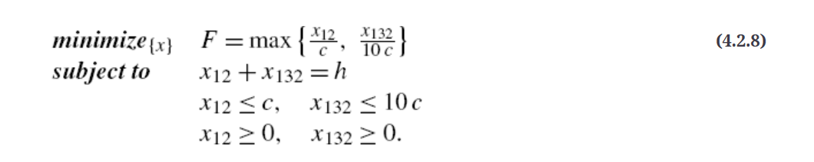
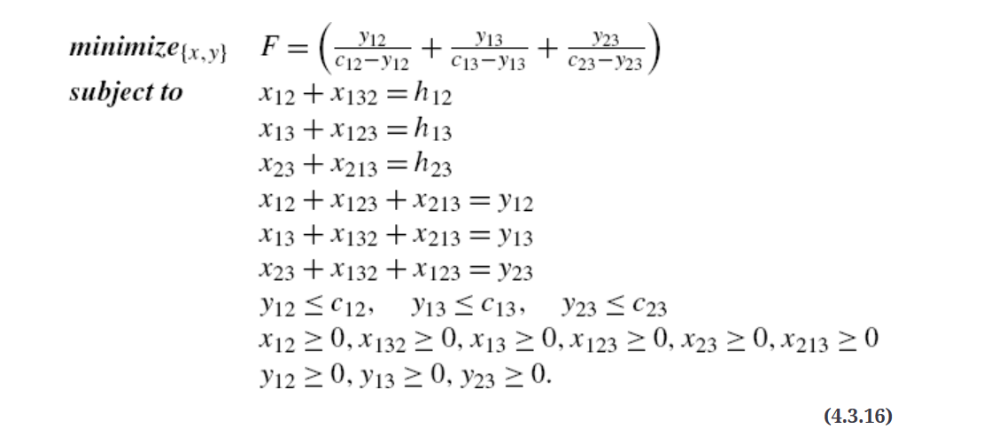

[Single-Commodity Network Flow](#single-commodity-network-flow)

[Minimum Cost Routing Objective](#minimum-cost-routing-objective)

[Load Balancing](#load-balancing)

[Average Delay](#average-delay)

[Multicommodity Network Flow](#multicommodity-network-flow)

[Summary](#summary)


Routing Efficiency -> Traffic Engineering

traffic volume - traffic network - IP/telephone network - traffic routing
demand volume - transport network - DS3-cross-connect, SONET, WDM network where circuits are deployed - transport routing/ circuit routing/ demand routing

In this chapter, we will uniformly use the term demand volume, 
without attaching a particular measurement unit or a network type
since our goal here is to present the basic concepts of network flow models.


 Any amount of demand volume that uses or is carried on a path is referred to as **flow**; 
 this is also referred to as **path flow**, 
 or **flowing demand volume** on a path, 
 or even **routing demand volume** on a path. 


## Single-Commodity Network Flow


three node network


actual routing decision should depend on the goal of routing, irrespective of the hop count. 
This means that we need a generic way to represent the problem so that various situations can be addressed in a capacitated network in order to find the best solution.

capacity: c
demand volume: h
demand volume on path 1-2: x12
demand volume on path 1-3-2: x132


(4.2.1a), (4.2.1b), and (4.2.1c) is referred to as constraints of the problem


### Minimum Cost Routing Objective


non-negative cost per unit of flow on each path


The total cost is referred to as the objective function. In general, the objective function will be denoted by F. If the goal is to minimize the total cost of routing, we can write the complete problem as follows:


The problem presented in Eq. (4.2.3) is a **single-commodity network flow** problem; 
it is also referred to as a **linear programming problem** 
since the requirements  are all linear, 
and the goal is also linear.
formulation of an **optimization problem**


For clarity, the optimal solution to a problem such as Eq. (4.2.3) will be denoted with asterisks in the superscript, for example, 
 and .


if , then ; similarly, 

if , then the minimum is observed when .


### Load Balancing


We now consider another goal — minimization of maximum link utilization, 
or the **minimax problem**. 
This goal is also referred to as **load balancing** flows in the network, 
or **congestion minimization** in the network. Perhaps, 
it is best to refer to this objective as the **Wozencraft objective** since he first suggested this objective [880]


The link utilization is defined as the amount of flow on a link divided by the capacity on that link. 

Then, the maximum utilization over all links means the maximum over these two expressions, i.e.


Thus, we see that when the load balancing of flows is the main goal, the optimal solution for Eq. (4.2.6) is to **split the flows equally on both paths**. Certainly, this result holds true as long as the demand volume h is up to and including 2c; the problem becomes infeasible when .


Variation in Capacity




### Average Delay

Another goal commonly defined, especially in data networks, is the minimization of the **average packet delay**. 

For this illustration, we consider again the three-node network with demand volume h between node 1 and node 2; the capacity of all links is set to c. 

The average delay can be captured through the expression
(why?)


This is a nonlinear function that we want to minimize. We can use calculus to solve this problem. 


## Multicommodity Network Flow

### Minimum Cost Routing Objective

In this section, we consider multiple commodities, that is multiple demand pairs have positive demand volumes. As with the single-commodity case, we will consider again the three different objectives.


the demand volume between nodes 1 and 2 will be identified as , between 1 and 3 as , and between 2 and 3 as .


 The amount of flow on each path is the unknown that is to be determined based on an objective; we denote the unknowns as  for path 1-2 for demand pair 1:2, and  for path 1-3-2, and so on


 

 We denote capacities of links 1-2, 1-3, and 2-3 by , , and , respectively.

| destination | <= c12 | <= c13 | <= c23|
| -- | -- | --| --|
| 1->2 | x12 | x132 | x132 |
| 1->3 | x123 | x13 | x123 |
| 2->3 | x213 | x213 | x23 |


If the unit costs of routing on paths 1-2, 1-3-2, 1-3, 1-2-3, 2-3, and 2-1-3 are denoted by  ... 


LP problems can be solved using the well-known simplex method, and other methods such as the interior point method; for example, see [210], [608], and [835]. 

There are fortunately many software packages for solving LP problems; for example, see [288] for a survey of LP solvers. Such a package allows a user to enter the problem almost in the way it is described in Eq. (4.3.4).

We will use CPLEX [200], a popular LP solver for this illustration.

```
Minimize 2 x12 +  x132 + 2 x13 +  x123 + 2 x23 +  x213
subject to
d12:   x12 + x132 = 5
d13:   x13 + x123 = 10
d23:   x23 + x213 = 7
c12:   x12 + x123 + x213 <= 10
c13:   x132 + x13 + x213 <= 10
c23:   x132 + x123 + x23 <= 15
Bounds
 0 <= x12
 0 <= x132
 0 <= x13
 0 <= x123
 0 <= x23
 0 <= x213
End

```

solution
```
CPLEX> display solution variables -
Variable Name           Solution Value
x12                           1.000000
x132                          4.000000
x13                           3.500000
x123                          6.500000
x23                           4.500000
x213                          2.500000
```


If some of the variables take integral(integer) values, then such problems are labeled as mixed integer linear programming (MILP) problems; 

if all variables take integral values, then such problems are referred to as integer linear programming (ILP) problems. 


Furthermore, a problem with integrality constraints cannot be solved by the simplex method; 
instead, methods such as **branch-and-bound** and **branch-and-cut** are used.
Tools such as CPLEX support these methods in addition to the simplex method


### Load Balancing

 If we denote the link-flow on link 1-2 by , then based on our discussion earlier, we can write

 


 ### Minimum Average Delay: Illustration




## Multicommodity Network Flow: General Link-Path Formulation


| Notation | Explanation |
| -- | -- |
| Given: |
| K |	Number of demand pairs with positive demand volume
| L |	Number of links
| hk |	Demand volume of demand index k = 1,2,...,K
| cℓ |	Capacity of link ℓ = 1,2,...,L
| Pk |	Number of candidate paths for demand k, k = 1,2,...,K
| δkpℓ |	Link-path indicator, set to 1 if path p for demand pair k uses the link ℓ; 0, otherwise
| ξkp |	Non-negative unit cost of flow on path p for demand k
| Variables: |
| xkp |	Flow amount on path p for demand k
| yℓ |	Link-flow variable for link ℓ


## Node-Link Formulation

|Notation |	Explanation |
|-- |-- |
|Given: | 	
| N |	Number of nodes (indexed by v = 1,2,...,N)
| L |	Number of directional links
| s |	Source node
| t |	Destination node
| h |	Demand volume for source s to destination t
| cℓ |	Capacity on link ℓ = 1,2,...,L
| ξℓ |	per unit flow cost on link ℓ = 1,2,...,L
| αvℓ |	1 if link ℓ originates at node v; 0, otherwise (incidence indicator)
| βvℓ |	1 if link ℓ terminates at node v; 0, otherwise (incidence indicator)
| Variables: |	
| zℓ |	Flow on link ℓ


## Summary

In this chapter, we introduce you to network flow modeling, especially to link-path formulation of the single- and multicommodity network flow problems along with consideration of different objective functions. Such models are often used in traffic engineering of communication networks. Thus, the material here serves the purpose of introducing you to how to do abstract representations of flows and paths, especially when it comes to network modeling.

It may be noted that we have presented Formulations (4.4.8) and (4.4.10) assuming that flow variables take continuous values. In many communication networks problems, flow variables are integer-valued only or the demand volume for a demand pair is non-splittable (refer to Formulation (4.5.3)). Similarly, objective functions other than the ones illustrated here can be developed for appropriate problems. These variations will be introduced later in the book when we discuss specific communication network routing problems.


## References

[19] R.K. Ahuja, T.L. Magnanti, J.B. Orlin, Network Flows: Theory, Algorithms, and Applications. Prentice-Hall; 1993.

[95] T. Benson, A. Akella, D.A. Maltz, Network traffic characteristics of data centers in the wild, Proc. of the 10th ACM SIGCOMM Conference on Internet Measurement. 2010:267–280.

[104] D. Bertsekas, Network Optimization: Continuous and Discrete Models. Athena Scientific; 1998.

[200] CPLEX, CPLEX User's Manual. ILOG; 1999.

[210] G.B. Dantzig, M.N. Thapa, Linear Programming 2: Theory and Extensions. Springer; 1997.

[253] V. Erramill, M. Crovella, N. Taft, An independent-connection model for traffic matrices, Proc. of the 6th ACM SIGCOMM Conference on Internet Measurement. 2006:251–256.

[283] L.R. Ford, D.R. Fulkerson, A suggested computation for maximal multicommodity network flows, Manag. Sci. 1958;5:97–101.

[284] B. Fortz, M. Thorup, Internet traffic engineering by optimizing OSPF weights, Proc. IEEE INFOCOM'2000. Tel Aviv, Israel. March 2000:519–528.

[288] R. Fourer, 2003 software survey: linear programming, ORMS Today December 2003;30(6):34–43.

[289] L. Fratta, M. Gerla, L. Kleinrock, The flow deviation method: an approach to store-and-forward communication network design, Networks 1973;3:97–133.

[297] R.G. Gallager, A. Segall, J.M. Wozencraft, Data Network Reliability – First Annual Report. [Tech. Rep. ESL-IR-677] Electronic Systems Lab, MIT; July 1976. http://oai.dtic.mil/oai/oai?verb=getRecord&metadataPrefix=html&identifier=ADA030012.

[425] R.E. Kalaba, M.L. Juncosa, Optimal design and utilization of communication networks, Manag. Sci. October 1956;3(1):33–44.

[444] J.L. Kennington, R.V. Helgason, Algorithms for Network Programming. Wiley-Interscience; 1980.

[484] L. Lasdon, Optimization Theory for Large Systems. MacMillan; 1970.

[501] X. Liu, S. Mohanraj, M. Pióro, D. Medhi, Multipath routing from a traffic engineering perspective: how beneficial is it? Proc. of IEEE 22nd International Conference on Network Protocols. ICNP. 2014:143–154.

[571] A. Medina, N. Taft, K. Salamatian, S. Bhattacharyya, C. Diot, Traffic matrix estimation: existing techniques and new directions, ACM SIGCOMM Comput. Commun. Rev. 2002;32(4):161–174.

[608] K. Murty, Linear Programming. Wiley; 1983.

[630] A. Nucci, A. Sridharan, N. Taft, The problem of synthetically generating IP traffic matrices: initial recommendations, ACM SIGCOMM Comput. Commun. Rev. 2005;35(3):19–32.

[666] M. Pióro, D. Medhi, Routing, Flow, and Capacity Design in Communication and Computer Networks. Morgan Kaufmann Publishers; 2004.

[720] M. Roughan, Simplifying the synthesis of Internet traffic matrices, ACM SIGCOMM Comput. Commun. Rev. 2005;35(5):93–96.

[819] J. Tomlin, Minimum-cost multicommodity network flows, Oper. Res. 1966;14(1):45–51.

[827] P. Tune, M. Roughan, Spatiotemporal traffic matrix synthesis, Proc. of the 2015 ACM Conference on Special Interest Group on Data Communication. 2015:579–592.

[835] R.J. Vanderbei, Linear Programming: Foundations and Extensions. 2nd edition Kluwer Academic Publishers; 2001.

[876] B. Yaged, Minimum cost routing for static network models, Networks 1971;1:139–172.

[880] J. Yee, “Private email communication,” August 20, 2014.

[892] Y. Zhang, M. Roughan, N. Duffield, A. Greenberg, Fast accurate computation of large-scale IP traffic matrices from link loads, ACM SIGMETRICS Perform. Eval. Rev. 2003;31(1):206–217.